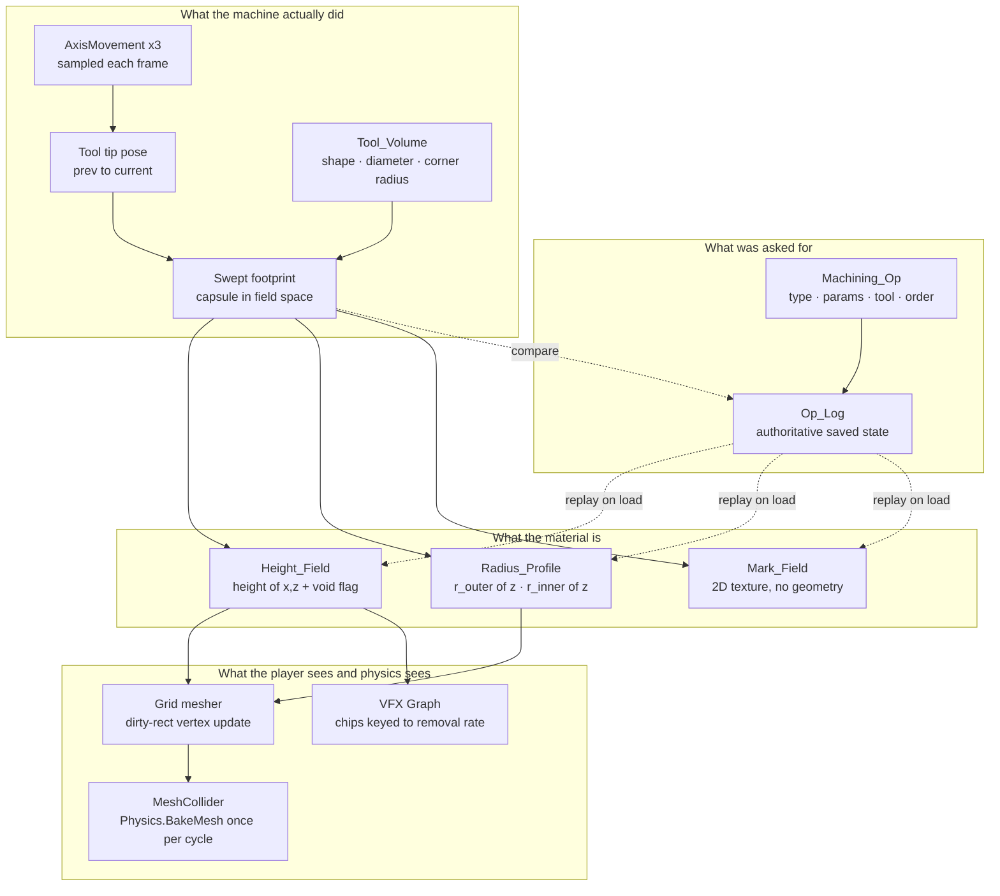

# 01 — Station Material Transformation: Capability Research

**Question this answers:** can Unity actually *carve* the epoxy block the way the ProMill cuts it — face, pocket,
contour, drill, slot — and can the same machinery serve the lathe, the engraver, and whatever station comes
next? What does each option cost, and what does it cost *in this project specifically*?

**Scope:** the geometry/representation layer only. Toolpath authoring, G-code interpretation, and cutting-force
physics are named where they touch the design but are not specified here.

**Confidence marks:** 🔴 = unverified, needs a measurement in this repo or on the lab machine. Everything else
is either verified in this repo (file:line given) or sourced in §12.

---

## 0. The short version

| | |
|---|---|
| **Is it possible?** | Yes, and cheaply. All five mill operations are **3-axis, tool-axis-monotone** — none produces an undercut. That makes a **height field** (Z-map) a *geometrically exact* representation, not an approximation. |
| **What to build** | A per-station **material field** + a **station-agnostic tool volume**, driven by the machine's *actual sampled motion*, with an **operation log as the authoritative saved state**. |
| **Mill** | 2-D height field over the top face. Field cell 0.25 mm → ~96 k cells for a 100 × 60 mm blank; ~384 KB. The carve itself costs **microseconds per frame**; the entire cost is the mesh update, and that is a dirty-rect update of ~200 vertices. |
| **Lathe** | The same idea one dimension down: a **radius profile** `r(z)` revolved. Cheaper than the mill. |
| **Engraver** | **No geometry at all** — a 2-D mark field into base-colour/roughness, or a URP Decal Projector. Real engraving depth is 0.05–0.3 mm; you cannot see it and should not model it. |
| **What NOT to build** | Runtime mesh booleans (CSG) or voxel/marching-cubes. Both are strictly more expensive and strictly less exact for these five operations. They only earn their cost if a 4th axis, a T-slot cutter, or robot milling enters scope — none of which is in M1–M6. |
| **Two blockers found in this repo** | `EpoxyBlock.fbx` has `isReadable: 0` → any CPU mesh read works in the Editor and **throws in a build**. `Epoxy.mat` is **transparent with `_ZWrite: 0`** → the moment the block has an interior, alpha sorting breaks. Both are §9. |
| **Off-the-shelf?** | **Nothing exists.** The survey in §5 found no Unity package that does CNC material removal. The industry SDKs that do this (ModuleWorks, MachineWorks) are commercial C++ licensed to CAM vendors. We are building this. |

---

## 1. What "the block gets machined" means today

The current implementation is a **prefab swap**, and it is worth being precise about it because it is the honest
baseline every option below is measured against.

| Step | Where | What happens |
|---|---|---|
| Job runs | `Assets/Scripts/Job System/Job_Mill_Epoxy_Penholder.cs:29` | Arms the mill's RFID sensor to watch for `Item_Epoxy_Block` |
| Target seen | `Job_Mill_Epoxy_Penholder.cs:19-24` | `Destroy(...)` the block; `Instantiate` the `Epoxy Penholder` prefab in its place |
| The mill's own cycle | `Assets/Members/Colin/Item_Mill.cs:31-91` | Robot arm transfers in → `MillingAnimation.Play()` → transfers out |
| The cut motion | `Assets/Members/Colin/ProMill8000/MillingAnimation.cs:54-81` | Spindle plunges `plungeDepth`, table traces a `squareSize` square, spindle retracts |
| **The gap** | **`Item_Mill.cs:64`** | `//add the capabilities to modify the item in the mill here` |

So: the machine already *moves* correctly and the workpiece already *changes*, but the two are unconnected. The
motion cuts nothing and the change is a swap. Everything below is about closing that specific line.

Two other stations are stubs with the identical shape and the identical gap:
`Assets/Members/Alec/Item_Lathe.cs:9` and `Assets/Members/Ethan/Item_Laser_Engraver.cs:9`, both
`// TODO: implement ... processing`.

---

## 2. The requirement, stated geometrically

M1's stated objective is to "describe the 5 milling operations (face, pocket, contour, drill, slot)"
(`docs/VR_Modules/00_Program_Overview.md` §3). That list is the requirement. Here is what each one actually
demands of a geometric representation.

| Operation | Tool motion | Removed volume | Undercut? | Through-feature? |
|---|---|---|---|---|
| **Face** | Raster sweep at constant depth across the whole top | Slab | No | No |
| **Pocket** | Plunge, then raster/spiral inside a closed boundary | Prism with a flat floor and near-vertical walls | No | Optionally |
| **Contour** | Plunge, then follow a profile at depth | Swept prism along an open/closed curve | No | Optionally |
| **Drill** | Straight plunge on centre, retract | Cylinder | No | Usually **yes** |
| **Slot** | Plunge, then a single straight or curved pass | Swept prism, one tool wide | No | Optionally |

**The finding that decides the whole design:** every entry in the "Undercut?" column is *No*. The ProMill 8000 is
3-axis, ISO 20 taper, max tool Ø 10 mm (`docs/VR_Modules/06_CNCBase_Mockup/04_CNCBase_Reference.md` §5). With a
standard end mill on a 3-axis machine, the removed volume is always **monotone along the tool axis** — if a point
at height *h* is removed, everything above it in the same column is removed too.

A function `height(x, z)` therefore represents the machined result **exactly**, not approximately. There is no
fidelity being traded away. Undercuts require a T-slot/dovetail cutter, a tilted tool, or a 4th axis, and none of
those exist on this machine or in M1–M6 as scoped (`00_Program_Overview.md` §7).

The one wrinkle is the "Through-feature?" column: a hole that exits the bottom face is not a height, it is the
*absence* of a column. That needs one explicit "cell is void" flag in the field and a matching case in the
mesher. It is a small, bounded special case — not a reason to abandon the model.

**Axis mapping, because it will bite someone:** in this scene the tool axis is **Unity Y** (`MillingAnimation`
plunges `spindleY`) and the table axes are **Unity X and Z** (`worktableX`, `worktableZ`). The machine's own Z is
Unity's Y. Name the API in machine terms or in Unity terms — consistently, once — and document which.

---

## 3. The candidate representations

Six options, ordered by how much machinery they need. R2 is the recommendation.

### R0 — Prefab / staged-mesh swap
What exists today. Author the finished part in a DCC tool, swap it in when the cycle completes.
Optionally author intermediate stages ("raw / faced / pocketed / drilled") and swap at operation boundaries.

### R1 — Parametric op log with no runtime geometry
Record what was cut as data (`Pocket{x, z, w, h, depth}`), drive the visual from R0's staged meshes, but keep the
log as the real state. Everything gradeable and saveable comes from the log; the geometry is decoration.
**Worth noting: R1 is a component of the recommended design, not a competitor to it.**

### R2 — Height field / Z-map  ← **recommended**
A 2-D array of heights over the workpiece's top face. A cut is `field[i] = min(field[i], toolBottom)` over the
tool's footprint. Render as a grid mesh (or a static grid displaced in the vertex shader). Exact for all five
operations per §2. This is the same family as the "discrete z-map" that machining literature calls the most
widespread approach in the field (§12, dexel/z-map sources).

### R3 — Voxel / SDF + isosurface extraction
Store occupancy or signed distance in a 3-D grid; carve by subtracting the tool's SDF; regenerate the surface
with marching cubes, surface nets, or dual contouring. Handles arbitrary tool orientation and undercuts. Costs a
dimension of memory and a full remesh of every dirty chunk.

### R4 — Mesh boolean / CSG
Subtract the tool's swept solid from the workpiece mesh directly. Exact in principle, brittle in practice: mesh
booleans are hard to implement correctly because small numerical errors cause topological failures, and the
robust methods are historically too slow for interactive rates (§12). Repeated subtraction also grows triangle
count and degenerate geometry monotonically — 300 cuts in one cycle is 300 chances to produce a non-manifold
mesh.

### R5 — Dexel / tri-dexel
Store, per ray of a 3-D raster, the intervals of solid material. One-directional dexel ≈ R2; **tri**-dexel
stores intervals along all three axes and recovers undercuts and full-tool contact. This is what the machining
literature treats as the accuracy/efficiency sweet spot, and dexel-based simulation is reported as more
efficient than mesh-based methods for material removal (§12).

### Comparison

| | R0 swap | R1 op log | **R2 height field** | R3 voxel/SDF | R4 CSG | R5 tri-dexel |
|---|---|---|---|---|---|---|
| Exact for face/pocket/contour/slot | ✗ canned | ✗ canned | **✅ exact** | ~ isosurface error | ✅ exact | ✅ exact |
| Drill through-hole | ✗ canned | ✗ canned | ✅ w/ void flag | ✅ | ✅ | ✅ |
| Undercuts / 4th axis | ✗ | ✗ | **✗ cannot** | ✅ | ✅ | ✅ |
| Reuse for lathe | ✗ | ✅ | **✅ as `r(z)`** | ✅ | ✅ | ✅ |
| Reuse for engraver | ✗ | ✅ | ✅ overkill | ✗ overkill | ✗ | ✗ |
| Per-frame carve cost | 0 | 0 | **~200 cells** | dirty chunk remesh | full boolean | 3 × R2 |
| Mesh update cost | 0 | 0 | **dirty rect** | chunk rebuild | full rebuild | chunk rebuild |
| Memory (100 × 60 mm blank) | — | bytes | **~384 KB** | ~10–100 MB 🔴 | mesh only | ~1 MB |
| Collider story | trivial | trivial | grid → bake once | chunk colliders | rebake each op | grid → bake once |
| Save size | enum | bytes | **op log = bytes** | op log or grid | mesh blob | op log |
| Robustness risk | none | none | **low** | medium | **high** | low |
| Available library | n/a | n/a | none needed | several (§5) | several (§5) | none for Unity |
| Effort | S (done) | S | **M** | L | M–L | L |

---

## 4. Unity's actual toolbox

### 4.1 Already in this project — zero new dependencies

Checked against `Packages/manifest.json` and `Packages/packages-lock.json`.

| Capability | Package / API | Version here | Why it matters |
|---|---|---|---|
| Burst-compiled jobs | `com.unity.burst` | **1.8.29** (transitive via `entities.graphics`) | Field updates and mesh rebuilds off the main thread, SIMD |
| Native containers | `com.unity.collections` | **2.6.x** | `NativeArray<float>` field storage, no GC |
| SIMD math | `com.unity.mathematics` | **1.3.x** | `float3`, `math.min` — required by Burst anyway |
| Thread-safe mesh writes | `Mesh.AllocateWritableMeshData` / `ApplyAndDisposeWritableMeshData` | Unity 6000.3 | "You can access the resulting `MeshDataArray` and `MeshData` structs from any thread" |
| GPU-direct vertex writes | `Mesh.vertexBufferTarget` + `Mesh.GetVertexBuffer` | Unity 6000.3 | Write heights straight into the vertex buffer from a compute shader |
| Off-thread collider cooking | `Physics.BakeMesh(meshId, convex, options)` | Unity 6000.3 | "BakeMesh is thread-safe and does computations on the thread it was called from" — safe from a job, as long as one mesh is not baked from two threads |
| Min-blend into a render target | ShaderLab `BlendOp Min` | — | The cheapest possible GPU carve: stamp the tool footprint with min-blending |
| Atomic min in compute | `InterlockedMin` on a `uint` buffer | — | Same, order-independent, from a compute shader |
| GPU → CPU without stalling | `AsyncGPUReadback` | — | Get the field back for the collider and for measurement |
| Toolpath authoring | `com.unity.splines` | **2.8.3** | Already used by the conveyor (`Spline_Animate`); a toolpath is a spline |
| Chips / coolant / sparks | `com.unity.visualeffectgraph` | **17.3.0** | Emission rate driven by material-removal rate |
| Surface marking without geometry | URP Decal Projector | URP **17.3.0** | The correct engraver primitive |
| One boolean we already own | `UnityEngine.ProBuilder.Csg` | ProBuilder **6.1.2** | Union/Subtract/Intersect, **experimental**, editor tool gated behind "enable experimental features" |

Two things follow. First, **the recommended design needs no new package.** Second, the boolean route is the one
we already have a tool for, and it is the route this document argues against — which is worth saying out loud so
nobody "discovers" ProBuilder CSG later and assumes it was overlooked.

### 4.2 Rejected Unity built-ins

| Option | Why not |
|---|---|
| `Terrain` + `SetHeights` | A height field with the right API and entirely the wrong object model — world-axis-aligned, one per scene sensibly, its own renderer and collider, no arbitrary orientation. Take the idea, not the component. |
| Blend shapes / `SkinnedMeshRenderer` | Morphs between *authored* states only. This is R1 with extra steps, and it cannot represent a cut the trainee chose. |
| Cloth / soft body | Not material removal. |
| Draw-indirect-only procedural geometry | Fast to render, but there is no `Mesh`, so no `MeshCollider`, no CPU measurement, no save. Rules itself out for a workpiece the robot then picks up. |

---

## 5. Third-party library survey

Grouped by what they actually do. **License column is load-bearing** — a GPL library cannot ship in this build,
and an LGPL C++ library is only workable as a separately-linked native plugin DLL.

### Mesh booleans / CSG

| Library | Language | License | Verdict here |
|---|---|---|---|
| [ProBuilder `Csg`](https://docs.unity3d.com/Packages/com.unity.probuilder@6.0/manual/boolean.html) | C# | Unity package | **Already installed.** Explicitly "an experimental feature". Fine for one-off editor authoring; no robustness guarantees for 300 runtime subtractions. |
| [Manifold](https://github.com/elalish/manifold) | C++ (+ C FFI) | **Apache-2.0** | The strongest boolean available: "guaranteed manifold output", TBB-parallel, supports arbitrary vertex properties. C# binding exists ([`weianweigan/manifold-csharp`](https://github.com/weianweigan/manifold-csharp)) and people have driven it from Unity — including [a filed normals bug](https://github.com/elalish/manifold/issues/1151). **The right choice *if* we ever need real booleans.** |
| [InteractiveAndRobustMeshBooleans](https://github.com/gcherchi/InteractiveAndRobustMeshBooleans) | C++ header-only | **MIT** | SIGGRAPH Asia 2022. Exact predicates, interactive frame rates up to ~200 K triangles. Research-grade; needs a native plugin wrapper. |
| [MCUT](https://github.com/cutdigital/mcut) | C++ | **GPL / paid commercial** | Dual-licensed. **Do not use** without buying a licence. |
| [SabreCSG](https://github.com/sabresaurus/sabrecsg) | C# | MIT | **Archived Feb 2024.** Level-design brushes, not workpieces. |
| RealtimeCSG, `pb_CSG`, Net3dBool | C# | varies | All descendants of `csg.js`-era float booleans. Level design, not 300 sequential subtractions of a translucent solid. |

### Voxel / SDF / sculpting

| Library | Language | License | Verdict here |
|---|---|---|---|
| [geometry3Sharp](https://github.com/gradientspace/geometry3Sharp) | **pure C#** | **Boost** | `DMesh3`, `MeshSignedDistanceGrid`, `MarchingCubes`/`MarchingCubesPro`, `CachingMeshSDF`. No native plugin, no build step. **But** it is class-based and allocating — GC pressure is the wrong shape for a 90 Hz VR frame. Excellent for *editor-time* baking; treat per-frame use as unproven 🔴. `MatterHackers` maintains a fork. |
| [MudBun](http://longbunnylabs.com/mudbun/) | C# + compute | paid asset | Runtime SDF brushes with union/**subtraction**/intersection, four meshing modes (marching cubes, dual quads, surface nets, dual contouring), **mesh-collider generation**, non-destructive brush stack. The closest thing to a shrink-wrapped answer for R3. Aimed at stylised VFX, not metrology. |
| [Clayxels](https://www.clayxels.com/) | C# + compute | **free**, open C# API | SDF sculpting with exposed math; point-cloud/splat rendering rather than a clean mesh. Now "joined Unbound and evolving" — treat continuity as a risk. |
| Digger PRO | C# | paid asset | Marching-cubes digging **for Unity Terrain**. Right algorithm, wrong host object. Reference only. |

### Plane cutting (a different primitive — splits one object into two)

| Library | License | Verdict |
|---|---|---|
| [EzySlice](https://github.com/DavidArayan/ezy-slice) | MIT | Plane slice with UV/normal/tangent interpolation; retriangulates the cross-section **for convex meshes only**. The right tool for a **parting cut on the lathe** or a bandsaw station. Wrong tool for a pocket. |
| DynamicMeshCutter / RayFire | paid | Same primitive, more polish. Same mismatch. |

### CAM / machining-specific

| Library | License | Verdict |
|---|---|---|
| [OpenCAMLib](https://github.com/aewallin/opencamlib) | **LGPL v2.1** | Implements exactly the algorithm R2 needs: the **drop-cutter** ("drops a cutter positioned at a predefined (x,y) until it touches the 3D model") plus push-cutter/waterline. C++ with Python/Node bindings. LGPL is satisfiable via a native DLL, but the algorithm is ~40 lines for our tool shapes — **read it, don't link it.** |
| ModuleWorks / MachineWorks | commercial | The actual industry cutting-simulation kernels behind mainstream CAM products. C++, licensed to software vendors, no Unity binding, pricing not public. **Benchmark for correctness, not a dependency.** |

### Prior art worth knowing

A 2023 *Int. J. Adv. Manuf. Technol.* paper builds a milling-robot digital twin **on Unity3D** and "designs a
material removal algorithm based on mesh deformation" (§12). Same engine, same problem, mesh-deformation family —
i.e. the R2/R3 side of the line, not the boolean side. That is independent support for the recommendation.

**Overall survey result: there is no Unity package for CNC material removal.** The pieces exist; the assembly
does not.

---

## 6. Recommended architecture

The request was to "design the stations to freely transform the objects with their intended functionalities." The
way to get that without a per-station rewrite is to separate three things that are usually tangled: **what the
tool is**, **what the material is**, and **what was asked for**.

### 6.1 The three pieces

**`Tool_Volume` — station-agnostic.** Shape enum (flat end mill / ball nose / bull nose / drill point / lathe
insert / laser spot), diameter, corner radius, plus the reduction to a 2-D footprint: for a height field, what
matters is the tool's *lower envelope* — `h(dx, dz)` relative to the tip. Flat end mill: a disc. Ball nose: a
paraboloid cap. That is the whole tool model, and it is the drop-cutter formulation OpenCAMLib uses.

**`Material_Field` — per station class.** One interface, three implementations, because "intended functionality"
differs by machine, not by object:

| Station | Field | Ops it gets for free | What it structurally cannot do |
|---|---|---|---|
| **Mill** (`Item_Mill`) | `height(x, z)` + void flag | face, pocket, contour, drill, slot | undercuts, side-milling with a tilted tool |
| **Lathe** (`Item_Lathe`) | `r_outer(z)`, `r_inner(z)` | facing, turning, boring, grooving, drilling on centre | non-axisymmetric features; **parting** is a plane cut (EzySlice), not a field update |
| **Laser engraver** (`Item_Laser_Engraver`) | `mark(u, v)` texture | engraving, marking, rastered images | cutting through — that is a different station |
| **Additive** (if ever) | same `height` field, `max` instead of `min` | layer deposition | — |
| **Arm / ASRS / conveyor** | **none** | — | These transform *pose and ownership*, not shape. Do not give them a field. |

Threading on the lathe and hatch texture on the mill are **shader detail, not geometry** — a normal map keyed to
feed-per-revolution. Do not model a thread helix.

**`Op_Log` — the authoritative state.** What gets saved through `Save_Data_Interface`
(`Assets/Scripts/Save_System/Save_Data_Interface.cs`) is the **list of operations**, not the field. Replay
rebuilds the field deterministically on load.

Why this and not "save the height field": the log is bytes instead of hundreds of KB; it survives a change of
field resolution; it survives *replacing the evaluator entirely* (R2 → R5) without invalidating saved progress;
and it is directly gradeable — comparing the log against the expected program is the assessment.

### 6.2 Drive the field from motion, not from intent

The tempting shortcut is `Cut_Pocket(x, z, w, h, depth)` — call an op, get a pocket. Don't. Sample the actual
tool-tip pose from the `AxisMovement` transforms each frame and stamp the swept footprint. Three consequences,
all good:

1. Any future motion source carves for free — the M1 demo animation, a handwheel jog (`Turn_Knob` in
   `docs/VR_Modules/04_Interaction_Ideas_Backlog.md` §2), a G-code interpreter, a trainee dragging an axis.
2. The picture and the geometry cannot disagree, because there is only one source.
3. **Motion-vs-log divergence becomes a signal.** The program asked for a 5 mm pocket; the motion cut 8 mm;
   the tool passed through the vise jaw. Those are the assessment moments, and they only exist if the field is
   driven by motion while the log records intent.

### 6.3 Where it plugs into existing code

| Insertion point | Change |
|---|---|
| `Assets/Members/Colin/Item_Mill.cs:64` | The marked TODO. Begin/end a `Machining_Cycle` around `millingAnimation.Play()`. |
| `MillingAnimation.cs:54` | Stays as-is. It becomes *one* motion source, not the definition of the cut. |
| `AxisMovement.cs:25` `CurrentPosition` | Already exposes what the sampler needs. No change. |
| `Item_Lathe.cs:9`, `Item_Laser_Engraver.cs:9` | The two `// TODO` stubs get their field type and nothing else. |
| `Job_Mill_Epoxy_Penholder.cs:19-24` | The destroy/instantiate swap is **deleted** at T2 — the block becomes the penholder by being cut. |
| `Lesson_Sequencer` / quiz scoring | New assessable step kinds read the field and the log. Append-only per `04_Interaction_Ideas_Backlog.md` §1. |

---

## 7. Staged plan

Each tier is independently shippable and each has a check that either passes or does not. Sizes are relative
(S/M/L), matching `04_Interaction_Ideas_Backlog.md`.

| Tier | What | Effort | Verify |
|---|---|---|---|
| **T0** | Prefab swap (today) | done | Block in → penholder out. Already true. |
| **T1** | Op log + staged meshes. Author raw/faced/pocketed/drilled variants; swap at op boundaries; record the log; persist it. | **S** | The five-operations lesson shows a *different block* after each operation; save → reload restores the same stage. Honest limitation: a wrong cut still produces the right result. |
| **T2** | **Height field on the mill**, fed by sampled motion. Grid mesher with dirty-rect updates. Collider baked once per cycle. Log replay rebuilds the field. | **M** | Plunge the spindle by hand into the block → a hole appears where the tool went, to the depth it went. Pocket demo produces a pocket whose measured depth matches `plungeDepth`. Log replay reproduces the field bit-for-bit. In-HMD frame time unchanged within noise. |
| **T3** | Generalise: lathe `r(z)`, engraver mark field, shared `Tool_Volume`. | **M** | `Item_Lathe` turns a visible step down. Engraver leaves a mark you can read. Both survive save/load. |
| **T4** | Assessment layer: gouge/collision detection, as-machined vs. spec comparison, in-VR measurement. | **M** | Cutting the vise is *detected and scored*, not just drawn. |
| **T5** | R3/R5 upgrade — voxel/SDF or tri-dexel. | **L** | **Only if** a requirement arrives that needs undercuts, a tilted tool, or robot milling. Nothing in M1–M6 does. The op log means this does not invalidate saved progress. |

---

## 8. The numbers

### Resolution

Tool Ø **3.175 mm** is what the real Machine Info panel shows (`04_CNCBase_Reference.md` §3.6); max tool Ø is
10 mm. Blank footprint below is a **nominal 100 × 60 mm** — 🔴 `Assets/Meshes/EpoxyBlock.fbx` bounds not read
(see §11).

| Cell | Grid | Grid-mesh verts | Tris | Field @ 4 B | Cells across the Ø3.175 tool |
|---|---|---|---|---|---|
| 1.0 mm | 100 × 60 | 6 161 | 12 000 | 24 KB | 3.2 — blocky, rejects |
| 0.5 mm | 200 × 120 | 24 321 | 48 000 | 96 KB | 6.4 — acceptable |
| **0.25 mm** | **400 × 240** | **96 641** | **192 000** | **384 KB** | **12.7 — recommended** |
| 0.125 mm | 800 × 480 | 385 281 | 768 000 | 1.5 MB | 25 — no visible gain |

**Why 0.25 mm is enough, in arcminutes.** A pocket wall in a height field is not vertical; it is one cell wide.
At 0.25 mm and a 0.5 m viewing distance that slope subtends ≈ **1.7 arcmin**. A Quest 3 pixel is ≈ 2.4 arcmin, so
the staircase is **sub-pixel** at normal inspection distance. Pressed to 0.15 m it becomes ≈ 5.7 arcmin ≈ 2 px —
visible, tiny, and honest.

Target is PC VR via Link on an RTX 5090 (`00_Program_Overview.md`), Quest standalone explicitly out of scope.
192 K triangles on one object is not a rendering concern on that machine at 90 Hz stereo.

### Per-frame cost

Frame budget at 90 Hz is **11.1 ms**.

Real feed rates: max programmed feed 2 540 mm/min = 42.3 mm/s; rapid traverse 5 000 mm/min = 83 mm/s
(`04_CNCBase_Reference.md` §5). At 90 fps that is **0.47 mm and 0.93 mm of travel per frame** — both smaller than
the 1.59 mm tool radius, so consecutive footprints overlap.

Cells touched by one swept stamp at 0.25 mm ≈ `(3.175 + 0.93)/0.25 × 3.175/0.25` ≈ **17 × 13 ≈ 220 cells**.
That is a plain loop over ~220 floats. **The carve is free.** The cost is entirely downstream:

| Downstream work | Naive | Do this instead |
|---|---|---|
| Vertex positions | rebuild all 96 641 | dirty-rect `SetVertexBufferData` on ~200 verts, or write heights into a texture and displace in the vertex shader |
| Normals | `RecalculateNormals()` on the whole mesh | recompute the dirty rect only |
| Bounds | recalculated every apply | `MeshUpdateFlags.DontRecalculateBounds`; bounds only shrink |
| `MeshCollider` | reassign `sharedMesh` per frame | **do not touch it during the cut** — see below |

### The speed trap

`AxisMovement.speed` defaults to **1 f** = 1 m/s = 60 000 mm/min — about **12× the machine's rapid traverse**. At
90 fps that is 11.1 mm/frame, or **7 tool radii**. Stamping a disc at the current position at that speed leaves a
row of disconnected craters.

Two fixes, and take both: stamp the **swept capsule** between the previous and current tip (a stadium footprint —
barely more code than a disc, and speed-independent), *and* bring the demo's feed rates toward the real machine's,
because a 12×-rapid demo is teaching a false feel of the machine regardless of the geometry.

### Colliders

While the block is clamped in the vise it is not a physics body — nothing needs to collide with it, and the tool
is scripted. So: **zero collider work during the cut.** At cycle end, `Physics.BakeMesh` on a worker thread, then
assign.

Then the awkward part. A **convex** `MeshCollider` is a hull of up to 255 triangles — it *erases the pocket*, which
is the entire point of the part. A **non-convex** `MeshCollider` keeps the pocket but is unsupported on a
GameObject with a Rigidbody, and the finished penholder gets picked up by the robot arm and by the trainee.

Recommendation: **convex hull for handling** (a pocket does not change how a block is grasped) plus an **XRI socket
interactor for the pen**, rather than an exact non-convex collider so a pen can physically drop into the hole.
Cheaper, and far more forgiving in VR than a 0.25 mm-accurate hole.

---

## 9. Hazards specific to this project

These are the ones that will cost real time, found by reading this repo rather than by reasoning about geometry.

### H1 — `EpoxyBlock.fbx` is not readable. This is a build-only failure.
`Assets/Meshes/EpoxyBlock.fbx.meta` has **`isReadable: 0`**. In the Editor, mesh data is always available, so
every CPU-side read — `mesh.vertices`, `AcquireReadOnlyMeshData`, any CSG, `Physics.BakeMesh` on the imported
mesh — works fine while you develop and **fails in a player build**. Flip Read/Write Enabled on the importer
before any of this is trusted. Applies to every stock mesh any station intends to transform.

### H2 — `Epoxy.mat` is transparent, and a carved block has an interior.
`Assets/Materials/Epoxy.mat`: `_Surface: 1` (Transparent), `_Blend: 0` (Alpha), `_ZWrite: 0`, `_Cull: 2` (back),
`_BaseColor.a = 0.294`. Alpha blending is order-dependent and URP sorts **per renderer, not per triangle**. Today
the block is a convex box and that is invisible. Give it a pocket and you are compositing pocket walls, the floor,
and the far outer wall in index order — the result reads as visual garbage even when the geometry is perfect.

Options, in order of cost: force depth write on the material and accept hard edges; author the *interior* as a
separate opaque submaterial (cut faces are freshly-machined and would plausibly be lighter and rougher anyway —
this is physically motivated, not a hack); or make the whole block opaque. **Decide this before T2**, because it
changes what the mesher must output: a second submesh for cut faces is nearly free if planned and annoying if
retrofitted.

### H3 — Units are metres; the demo depths are theatrical.
1 Unity unit = 1 m is confirmed (mill travels ±0.14 m = 280 mm, `04_CNCBase_Reference.md` §5). So
`MillingAnimation.plungeDepth = -0.15` is a **150 mm** plunge, and M1's `-0.25` is **250 mm** — near full Z travel,
not a cut. `squareSize = 0.05` = 50 mm is a plausible pocket. The XZ scale is roughly right and the depth is
theatre. A carving system does not tolerate that: once the field is real, plunging 250 mm means the tool exits the
bottom of the blank. Pick real depths at T2.

### H4 — Machine Z is Unity Y.
`spindleY` is the tool axis; `worktableX`/`worktableZ` are the table. Any field indexed as "(x, y) → height" will
be read wrong by the next person. Name it in one convention and say which in the API docs.

### H5 — Carve state must never be scene data.
Prefab overrides have been silently dropped by merges on this repo before, and the M2 work has already seen a
post-play scene save zero out `RectTransform` overrides. A serialised height field living in a `.unity` or
`.prefab` file is a merge conflict that no one can read or resolve. The op log through `Save_Data_Interface` is
the only place this belongs.

### H6 — `Physics.BakeMesh` is thread-safe *per mesh*.
Safe to call from a job; **undefined behaviour** if two threads bake the same mesh at once. One workpiece, one
bake, one completion handoff.

### H7 — Nothing off the shelf does this.
Worth stating because it sets expectations: the §5 survey found no Unity package for CNC material removal, and
the closest published prior art is a research paper. Budget for building and testing a small amount of custom
geometry code, not for integrating a plugin.

---

## 10. What I would not build, and why

| Not this | Why |
|---|---|
| Runtime mesh booleans for the mill | Strictly more expensive and strictly *less* robust than a height field for operations that a height field represents exactly. 300 sequential subtractions on a translucent solid is 300 chances at a non-manifold mesh. Revisit only for genuine undercuts. |
| Voxel / marching cubes at T2 | Pays a dimension of memory and a remesh for undercut support that this 3-axis machine cannot produce. Also introduces isosurface error where the height field has none. |
| A G-code interpreter | Not needed to carve, and G-code writing was **dropped from the roadmap** (`00_Program_Overview.md` §1). Trainees run programs; the canned `start_fms.nc` toolpath is enough. |
| Cutting forces, deflection, chatter, tool wear physics | The literature this borrows from is largely about force prediction. That is not what M1–M3 assess. Chips and sound keyed to removal rate get the *feel* for a fraction of the cost. |
| Thread and knurl geometry on the lathe | Shader detail. Modelling a helix is a lot of triangles for something a normal map does better. |
| Geometry for laser engraving | The real depth is 0.05–0.3 mm — below one field cell and below one rendered pixel. A decal or mark texture is not a compromise, it is the correct model. |
| A field on the arm / ASRS / conveyor | They move things. They do not change shape. |

---

## 11. Open questions

| # | Question | Blocks |
|---|---|---|
| **Q1** 🔴 | `EpoxyBlock.fbx` actual bounds. Every number in §8 is scaled off a nominal 100 × 60 mm. | Choosing the field resolution |
| **Q2** 🔴 | Is the epoxy blank in the real lab metric or imperial, and what size? | Q1, and whether depths read as sane |
| **Q3** | H2 decision: opaque interior submaterial, forced depth write, or fully opaque block? | The mesher's output format at T2 |
| **Q4** | Does the finished penholder need a *physical* hole a pen can fall into, or is an XRI socket acceptable? | The collider strategy in §8 |
| **Q5** 🔴 | What does the lab's demo part actually cut? `start_fms.nc` is still unread (`04_CNCBase_Reference.md` §8). | Whether T1's staged meshes are the right stages |
| **Q6** | Do M1's operation demos need to produce a *correct* part, or a *legible* one? Legibility may argue for exaggerated depths, which fights H3. | T2 depth values |
| **Q7** | Should the mark field and height field share storage so a future station can both engrave and cut? | Only at T3; do not pre-solve |

---

## 12. Sources

**Unity APIs**
[`Mesh.AllocateWritableMeshData`](https://docs.unity3d.com/6000.3/Documentation/ScriptReference/Mesh.AllocateWritableMeshData.html) ·
[`Mesh.GetVertexBuffer`](https://docs.unity3d.com/6000.3/Documentation/ScriptReference/Mesh.GetVertexBuffer.html) ·
[`Physics.BakeMesh`](https://docs.unity3d.com/ScriptReference/Physics.BakeMesh.html) ·
[ShaderLab `Blend`/`BlendOp`](https://docs.unity3d.com/6000.3/Documentation/Manual/SL-Blend.html) ·
[Collider types and performance](https://docs.unity3d.com/2022.3/Documentation/Manual/physics-optimization-cpu-collider-types.html) ·
[`MeshCollider.convex`](https://docs.unity3d.com/ScriptReference/MeshCollider-convex.html) ·
[Enhanced physics performance](https://unity.com/how-to/enhanced-physics-performance-smooth-gameplay) ·
[Decals in URP](https://docs.unity3d.com/6000.1/Documentation/Manual/urp/renderer-feature-decal.html) ·
[ProBuilder Boolean operations](https://docs.unity3d.com/Packages/com.unity.probuilder@6.0/manual/boolean.html) ·
[Compute shaders](https://docs.unity3d.com/Manual/class-ComputeShader.html)

**Boolean / CSG libraries**
[Manifold](https://github.com/elalish/manifold) ·
[manifold-csharp](https://github.com/weianweigan/manifold-csharp) ·
[Manifold-in-Unity normals issue #1151](https://github.com/elalish/manifold/issues/1151) ·
[Interactive and Robust Mesh Booleans (arXiv 2205.14151)](https://arxiv.org/abs/2205.14151) ·
[…its code](https://github.com/gcherchi/InteractiveAndRobustMeshBooleans) ·
[Fast and Robust Mesh Arrangements](https://github.com/gcherchi/FastAndRobustMeshArrangements) ·
[MCUT](https://github.com/cutdigital/mcut) ·
[SabreCSG (archived)](https://github.com/sabresaurus/sabrecsg)

**Voxel / SDF / mesh tooling**
[geometry3Sharp](https://github.com/gradientspace/geometry3Sharp) ·
[MudBun](http://longbunnylabs.com/mudbun/) ·
[Clayxels](https://www.clayxels.com/) ·
[EzySlice](https://github.com/DavidArayan/ezy-slice)

**CAM / machining simulation**
[OpenCAMLib docs](https://opencamlib.readthedocs.io/en/latest/) ·
[OpenCAMLib source](https://github.com/aewallin/opencamlib) ·
[A digital twin-based machining motion simulation and visualization monitoring system for milling robot (IJAMT 2023)](https://link.springer.com/article/10.1007/s00170-023-11827-x) ·
[Multi-dexel based material removal simulation on GPGPUs](https://www.academia.edu/35534068/Multi_dexel_based_material_removal_simulation_and_cutting_force_prediction_with_the_use_of_general_purpose_graphics_processing_units) ·
[Voxel-based modeling of transient material removal in machining](https://www.researchgate.net/publication/352907848_Voxel-based_modeling_of_transient_material_removal_in_machining) ·
[Comparison of material removal simulation methods](https://www.researchgate.net/figure/Different-methods-for-material-removal-simulation-Within-this-contribution-we-will-focus_fig1_351426834) ·
[Digital Twins Give CNC Machining a Head Start (Modern Machine Shop)](https://www.mmsonline.com/articles/digital-twins-give-cnc-machining-a-head-start)

**In-repo**
`Assets/Members/Colin/Item_Mill.cs` · `Assets/Members/Colin/ProMill8000/MillingAnimation.cs` ·
`Assets/Members/Colin/ProMill8000/AxisMovement.cs` · `Assets/Scripts/Job System/Job_Mill_Epoxy_Penholder.cs` ·
`Assets/Members/Alec/Item_Lathe.cs` · `Assets/Members/Ethan/Item_Laser_Engraver.cs` ·
`Assets/Materials/Epoxy.mat` · `Assets/Meshes/EpoxyBlock.fbx.meta` · `Packages/packages-lock.json` ·
`docs/VR_Modules/00_Program_Overview.md` · `docs/VR_Modules/04_Interaction_Ideas_Backlog.md` ·
`docs/VR_Modules/06_CNCBase_Mockup/04_CNCBase_Reference.md`
