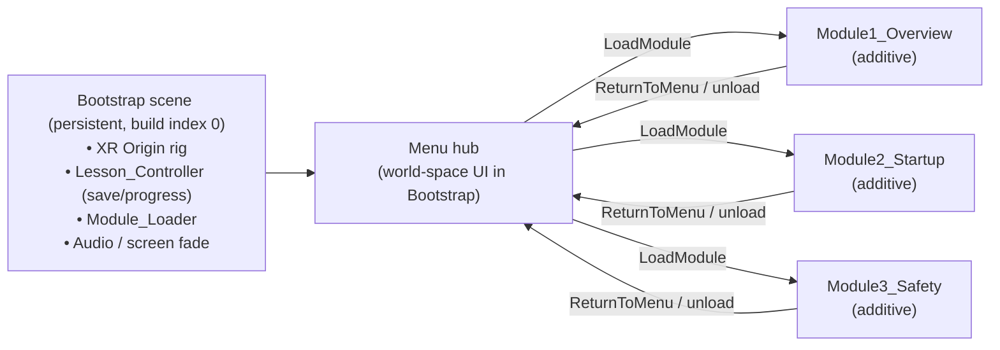

# CNC Mill VR Training — Program Overview

**Project:** CREST Subproject 2 · CNC Mill Station (ProMill 8000)
**Scope:** Category 2 — Development only. Category 1 (Research) and Category 3 (Lab Operations) are out of scope for this document.
**Target hardware:** Meta Quest 3 + HaptX gloves, **PC VR via Link** (tethered to the Alienware RTX 5090).
**Source of record:** `CNC_Mill_Tasks_2026.docx` → Category 2 — Development.

---

## 1. Goal

Design and build interactive VR training modules that teach a trainee to understand and operate the
ProMill 8000 CNC milling machine inside the Intelitek SmartCIM 4.0 cell.

The docx defines six modules (M1–M6). **This month targets the first three:**

| # | Module | Theme |
|---|--------|-------|
| **M1** | CNC Milling: What & Why | Machine overview, components, axes, milling operations |
| **M2** | System Startup & Program Execution | Powering the cell; SCORBASE + CNCBase startup; running `start_fms.nc`; standalone mode |
| **M3** | Safety & LOTO | E-stop, lockout/tagout, hazards, fault recovery |

M1 is the immediate focus; M2 and M3 follow once the shared foundation (XR rig + lesson system) is proven
in M1. M4–M6 are explicitly deferred.

**Reordered (June 2026), superseding the docx module order:** Safety moved behind the new System Startup
module, and **G-code writing was dropped from the roadmap** — trainees run NC programs (M2) but never write
them. Cell-level "total assembly line control" (CIM-managed mode) is deferred to a later module (see §7).

---

## 2. Lesson Format (shared by all modules)

Every module follows the same two-phase structure:

1. **Guided phase** — the trainee is walked through operating/using the machine with **interactive object
   highlights and prompts**. The current target is highlighted; a prompt explains it; the trainee must
   perform the correct interaction to advance. Step-gated: wrong actions do not advance the sequence.
2. **Practice phase** — the same tasks repeated **with no help**. Highlights and prompts are suppressed; the
   trainee's actions are scored. A **pass-gate** must be met to mark the module complete.

This format maps directly onto the docx assessment columns (e.g., M1's "9-part component ID quiz; ≥7/9 to
proceed").

The concrete UX layer for the guided phase — **part highlighting, task prompting, timers, progress**, plus
direct-grab/snap mechanics and the VR pitfalls behind them — is specified in
`02_HUD_and_Interaction_Pattern.md` (carried over from a proven sibling PCVR trainer).

---

## 3. Three-Module Roadmap

M1 and M3 are pulled from the docx *Module Specifications* and *Category 2 — Development* task tables.
M2 is new content (June 2026 restructure) — its full build plan is `03_Module2_Startup_Plan.md`.

### M1 — CNC Milling: What & Why
- **Objectives:** name all major components; explain X/Y/Z axes and the right-hand rule; describe the 5
  milling operations (face, pocket, contour, drill, slot); identify the ProMill 8000 in SmartCIM 4.0.
- **Guided interactions:** exploded-view tour with clickable labels; axis-motion demo; animated milling
  operations (face pass, pocket, drill).
- **Practice / assessment:** 6-part component-ID quiz.
- **Pass-gate:** ≥ 4/6.

### M2 — System Startup & Program Execution
- **Objectives:** power up both station PCs and machines in the correct order; bring the arm station active
  in SCORBASE (Control On → active, Search Home sync, **standalone** mode); bring the mill station active in
  CNCBase (connect active, home the mill, open and run **`start_fms.nc`** for local control); verify both
  systems respond.
- **Guided interactions:** physical power switches (station PCs, robot controller, ProMill 8000); simplified
  in-VR software panels using real SCORBASE/CNCBase terminology and step order — not pixel-accurate UI
  recreations.
- **Practice / assessment:** full startup sequence **unaided**; wrong-order actions count as errors; must
  end in the all-systems-active state plus a verification action (jog the arm / confirm mill status).
- **Pass-gate:** complete unaided startup ending with all systems active + verified.
- **Note:** trainees *run* NC programs here; G-code writing is not in the roadmap. CIM-managed (cell-level)
  control is only introduced conceptually — it's the subject of deferred module M5.

### M3 — Safety & LOTO
- **Objectives:** perform E-stop (teach pendant, controller button, OpenMES software stop); apply LOTO at 3
  isolation points; recall the 6 CNC safety rules; state the JAW-command constraint.
- **Guided interactions:** E-stop drill; LOTO tag placement; PPE selection; fault scenario (robot attempts
  entry with door closed).
- **Practice / assessment:** timed E-stop drill (< 5 s); LOTO 100% completion; safety quiz ≥ 80%.
- **HaptX begins here:** E-stop confirm haptic moment.

---

## 4. Phase 0 — Factory Training Template Evaluation (prerequisite)

Before building our own modules, import and study the Unity Asset Store **Factory Training** template
(package **344832**) as a reference example for VR lesson UX.

- **Import** into a sandbox folder (e.g., `Assets/ThirdParty/FactoryTraining/`) — **not** into the production
  `DigitalTwin.unity` scene.
- **Study** its approach to: step sequencing, highlight + prompt presentation, XR interaction setup, and
  assessment/scoring flow.
- **Record** which patterns to adopt versus what we already cover with existing project systems (see §5).
- **License note:** this is a **paid asset**. Confirm the license permits use in this repo before committing
  any of its files. If the license is uncertain, keep it local and reference patterns only.
- **Deliverable:** a short evaluation note appended here (or `02_FactoryTraining_Eval.md`) listing adopted
  patterns and rationale.

---

## 5. Shared Technical Foundation

All three modules reuse one foundation, built and proven in M1:

**Reuse (already in the project):**
- **Machine + motion:** `Assets/Members/Colin/ProMill8000/AxisMovement.cs` (X/Y/Z travel),
  `MillingAnimation.cs` (cutting sequence), `Item_Mill_Doors.cs` (guard door); mill models
  `Assets/Meshes/reconstructedPM8000.fbx` / `Mill.fbx`; rigged robot arm (Yaskawa Motoman GP8); vice models;
  perspex materials
  (`Blue_Glass.mat`, `Epoxy.mat`).
- **Interaction:** `Item_Parent.cs` + camera raycast (`Player_Controller.cs`); `Item_Station` + `Job_Queue`
  FIFO pattern (`Assets/Scripts/Job_System/`).
- **XR (~70% scaffolded):** OpenXR 1.16.1 + XR Interaction Toolkit 3.3.1; XR Plugin Management enabled for
  Standalone; Quest Touch Plus + hand-pose profiles on; XRI **Starter Assets** in
  `Assets/Samples/XR Interaction Toolkit/3.3.1/` (rigs, ray/poke interactors, **Fresnel highlight
  affordances**); `Entity_Player.cs` runtime XR detection with desktop fallback and empty hand-anchor slots.
- **Persistence + UI:** `Save_Data_Interface` / `Data_Loader`; `HUD.prefab`; TextMeshPro.

**Build once (the gap — no equivalent exists):**
- A **persistent Bootstrap scene** holding the shared XR rig, menu hub, and managers (see §6).
- A **guided-lesson system** (`Lesson_Step`, `Lesson_Sequencer`, `Lesson_Controller`) under
  `Assets/Scripts/Training/`, modeled on the `Job_Queue` FIFO pattern. Detailed in `01_Module1_Plan.md`.
- Completion of the **XR Origin rig** — built once in the Bootstrap scene (hand anchors, controller
  bindings), not duplicated per module.

See `01_Module1_Plan.md` for the full Module 1 build plan.

---

## 6. Scene Architecture

**One scene per module, plus one persistent Bootstrap scene that owns everything shared.**

### Why separate module scenes
- **Merge safety** — the primary driver. Merges touching a shared `.unity` file have silently dropped prefab
  overrides on this project before; one scene per module keeps M1/M2/M3 as independent files so team members
  build in parallel without colliding or losing inspector wiring.
- **Isolation** — a broken module can't break the others; lighter to load and iterate.
- **Ownership** — maps to the existing `Assets/Members/<name>/` team structure.

Shared content is *not* duplicated: the mill is a prefab (`reconstructedPM8000.prefab`), so each scene
references the single asset, and the XR rig / lesson system / save state live once in Bootstrap.

### Bootstrap + additive loading
Module scenes are loaded **additively** on top of a persistent Bootstrap scene that never reloads. This is a
VR-specific choice: full-scene swaps re-instantiate the XR rig on every transition, causing a tracking hitch
and re-running XR init. Keeping a single persistent rig avoids that.

- **Bootstrap** (build index 0) loads once and stays loaded — holds the single XR rig, `Lesson_Controller`
  (the one `Save_Data_Interface` implementor for training progress), audio, and a screen fade.
- The **menu** is a world-space panel in Bootstrap, so showing it requires no scene load.
- Selecting a module: `SceneManager.LoadSceneAsync(name, LoadSceneMode.Additive)` → `SetActiveScene` (so the
  module's lighting/skybox take over). "Return to menu": `UnloadSceneAsync`. The XR rig never reloads.

**Two things to wire deliberately:**
- Save/progress state lives in **Bootstrap**, not module scenes, so it survives load/unload and avoids the
  `Data_Loader` re-scan problem when `Save_Data_Interface` implementors come and go with additive scenes.
- Every scene must be added to **Build Settings → Scenes in Build** or `LoadSceneAsync` can't find it.

**Deliberately not used:** Addressables (overkill for 3 local scenes) and a single mega-scene with toggled
"rooms" (reintroduces the merge/override hazard).

---

## 7. Out of Scope
- Modules M4 (Robot Tending), M5 (Total Assembly Line Control — OpenCIM/OpenMES full-online, CIM-managed
  mode), M6 (Full Production Cycle). *(M5 replaced the docx's Toolpath/Offsets module, which was dropped
  along with G-code writing in the June 2026 restructure.)*
- Category 1 (Research) and Category 3 (Lab Operations).
- Quest 3 standalone / Android build (PC VR via Link only).
- HaptX SDK integration before M3 (Safety).
