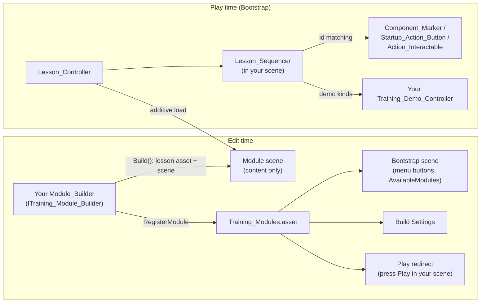

# VR Training Module Framework — HOWTO

How to build your own training module on the shared framework. The lesson
engine, editor tooling and prefabs are shared; your module is one builder
script + one lesson asset + one scene, all inside `Assets/Members/<You>/`.

## Where things live

| Location | Contents | Owner |
|---|---|---|
| `Assets/Scripts/Training/` | Runtime lesson engine (`Lesson_*`, `Module_Loader`, `Component_Marker`, `Marker_Registry`, `Action_Button_Registry`, `Startup_Action_Button`, `Action_Interactable`, `Panel_Tab_Group`, `Part_Highlighter`, `Marker_State_Toggle`, `Wrist_HUD`, `Face_Camera`, `Screen_Fader`, `Desktop_Click_Select`, `Training_Demo_Controller`, `Training_Module_Registry`) | shared — don't put module content here |
| `Assets/Scripts/Training/Editor/` | `Training_Builder_Core` (scaffolding + UI factories), `ITraining_Module_Builder`, `Training_Debug` (play-mode drivers), `Training_Play_Redirect`, `Module_Builder_Template.cs.txt` | shared |
| `Assets/Training/` | Generated framework assets: `Prompt_Panel.prefab`, `Component_Marker.prefab`, `Marker_Glow.mat`, and **`Training_Modules.asset`** (the module registry) | generated |
| `Assets/Members/<You>/Training/Editor/` | Your `<Xn>_Module_Builder.cs` (+ module-specific debug menu items) | you |
| `Assets/Members/<You>/Training/Lessons/`, `Scenes/` | Your lesson asset(s) and module scene | you |
| `Assets/Members/<You>/Training/Scripts/` | Your module-specific runtime scripts (e.g. Colin's `Mill_Demo_Controller`, `Startup_State_Controller`, `Door_Click_Toggle`) | you |

## How it fits together

Runtime flow: `Lesson_Controller` (Bootstrap, persistent) additively loads your
scene, finds its `Lesson_Sequencer`, and runs your `Lesson_Definition` steps —
Guided first (highlights on), then Practice (the `Include_In_Quiz` steps,
scored against `Quiz_Pass_Threshold`), then results + save. Steps connect to
scene objects purely by **string id**: a `Select_Component` step advances when
the `Component_Marker` with the matching `Marker_Id` is clicked; a
`Panel_Action` step when the matching `Action_Id` fires. Desktop mouse clicks
work automatically (`Desktop_Click_Select` raycasts when no headset is active).

## Creating a module

1. Copy `Assets/Scripts/Training/Editor/Module_Builder_Template.cs.txt` to
   `Assets/Members/<You>/Training/Editor/<Xn>_Module_Builder.cs` (folder must be
   named `Editor`). Rename the class, fill in the `<...>` placeholders.
2. Pick the next free `Order` (M1 = 0, M2 = 1). Order is both build order and
   menu position.
3. Write your steps in `BuildLessonAsset()` using the factories
   (`Info` / `Select` / `PanelAction`) from `Training_Builder_Core`.
4. Write `BuildScene()`: instantiate your machine prefab, create markers/buttons
   with `BuildComponentMarker` / `BuildActionButton` / `BuildPartAction`, then
   `BuildLessonScaffold(...)` for the prompt/results/sequencer plumbing, and add
   the registries your step kinds need (`Marker_Registry` for selects,
   `Action_Button_Registry` for actions).
5. Run **Training/0 Build Everything** (or just your own menu item followed by
   **Training/2 Build Bootstrap Scene** + **Training/4 Add Scenes To Build
   Settings**). Your module appears as a Bootstrap menu button automatically.
6. Test without a headset: open your module scene and press Play — the redirect
   boots Bootstrap and auto-enters your module. Use the **Training/8 Debug**
   menu items (`Auto Step`, `Auto Run To Completion`, wrong-answer, retry) to
   drive the flow, and left-click markers/buttons directly.

## Custom step kinds (demos, animations)

- `Info`, `Select_Component` and `Panel_Action` are handled by the sequencer.
  **Every other kind** is handed to the scene's `Training_Demo_Controller`
  subclass via `Play(step)`; call `Raise_Demo_Finished()` when your demo ends.
- Need a new kind (e.g. `Lathe_Demo`)? **Append it to the end** of
  `Lesson_Step_Kind` — it serializes as an int, so reordering corrupts every
  existing lesson asset. The sequencer needs no changes.

## Rules & gotchas

- **Scenes are generated.** Your builder is the source of truth — rebuilding
  wipes hand edits. If you tune transforms in the editor, bake the values back
  into your builder before rebuilding.
- **One scene per module, in your own `Members/<You>/` folder** — that's the
  merge-safety model (see `00_Program_Overview.md` §6). Module scenes are
  content-only: no XR rig, camera, EventSystem or managers (Bootstrap has them).
- **Don't edit shared files** (`Assets/Scripts/Training/`, `Training_Builder_Core`)
  for module content. The only shared thing you touch is appending to
  `Lesson_Step_Kind`, and the registry asset your builder writes automatically.
- **Everything compiles into one Assembly-CSharp** — class names are global, so
  prefix module-specific scripts distinctively (`Lathe_...`, `ASRS_...`).
- Placeholder menu buttons ("coming soon"): add an entry to
  `Assets/Training/Training_Modules.asset` in the Inspector with no Lesson and a
  `Placeholder_Label`, then rebuild Bootstrap.
- If your module depends on another module's build output (M2 reuses M1's
  `PM8000_Training.prefab`), a higher `Order` guarantees it builds later.
- After pulling changes that add someone's module, run **Training/0** once so
  your local Bootstrap menu and build settings pick it up.
