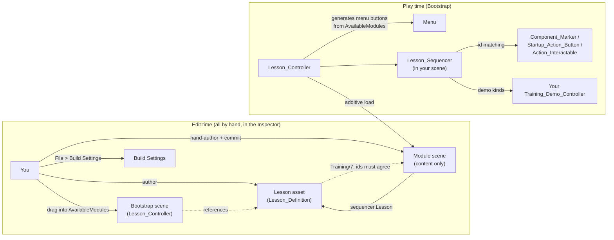

# VR Training Module Framework — HOWTO

How to build your own training module on the shared framework. The lesson
engine, editor tooling and prefabs are shared; your module is **one
hand-authored scene + one Inspector-authored lesson asset**, all inside
`Assets/Members/<You>/`. There is no builder script and no registration step:
the Bootstrap menu is generated at runtime from
`Lesson_Controller.AvailableModules`, and your scene points at its lesson via
`Lesson_Sequencer.Lesson`.

**Everything is an authored artifact** (2026-07-27/28 decisions,
`07_Scene_Authoring_Migration.md`): you author the scene and the lesson asset
in the editor and commit them like any other asset. **Training/7** validates
that scene and lesson agree — which is what generation used to guarantee.

## Where things live

| Location | Contents | Owner |
|---|---|---|
| `Assets/Scripts/Training/` | Runtime lesson engine (`Lesson_*`, `Module_Loader`, `Component_Marker`, `Marker_Registry`, `Action_Button_Registry`, `Startup_Action_Button`, `Action_Interactable`, `Panel_Tab_Group`, `Part_Highlighter`, `Marker_State_Toggle`, `Wrist_HUD`, `Face_Camera`, `Screen_Fader`, `Desktop_Click_Select`, `Training_Demo_Controller`) | shared — don't put module content here |
| `Assets/Scripts/Training/Editor/` | `Training_Validator` (Training/7), `Training_Debug` (play-mode drivers), `Training_Play_Redirect` (press Play in a module scene) | shared |
| `Assets/Training/` | Committed framework assets: `Prompt_Panel.prefab`, `Component_Marker.prefab`, `Module_Button.prefab`, `Marker_Glow.mat` | shared (committed) |
| `Assets/Members/<You>/Training/Editor/` | Optional module-specific debug menu items (`M1_Debug_Menu.cs` is the model) | you |
| `Assets/Members/<You>/Training/Lessons/`, `Scenes/` | Your lesson asset(s) and your hand-authored module scene — committed artifacts | you |
| `Assets/Members/<You>/Training/Scripts/` | Your module-specific runtime scripts (e.g. Colin's `Mill_Demo_Controller`, `Startup_State_Controller`, `Door_Click_Toggle`) | you |

## How it fits together

Runtime flow: `Lesson_Controller` (Bootstrap, persistent) generates one menu
button per `AvailableModules` entry (label = the lesson's `Display_Name`, list
order = menu order), additively loads your scene on click, finds its
`Lesson_Sequencer`, and runs your `Lesson_Definition` steps — Guided first
(highlights on), then Practice (the `Include_In_Quiz` steps, scored against
`Quiz_Pass_Threshold`), then results + save. Steps connect to scene objects
purely by **string id**: a `Select_Component` step advances when the
`Component_Marker` with the matching `Marker_Id` is clicked; a `Panel_Action`
step when the matching `Action_Id` fires. Desktop mouse clicks work
automatically (`Desktop_Click_Select` raycasts when no headset is active).

## Creating a module

1. **Create the lesson asset**: Project window → Create → Training → Lesson
   Definition → `Assets/Members/<You>/Training/Lessons/<Xn>_Lesson.asset`.
   Fill it in the Inspector:
   - `Module_Id` — short and **unique** (`M3`…); it is the save-file key, so
     never rename it after players have progress;
   - `Scene_Name` — the exact scene file name (no path, no extension);
   - `Display_Name` — becomes the menu button label;
   - `Steps` — step id convention: `Step_Id` **is** the `Target_Marker_Id`
     (`Select_Component` targets a `Marker_Id`, `Panel_Action` an `Action_Id`);
   - `Quiz_Pass_Threshold`, `Practice_Shuffles_Quiz` (off when order is the
     thing being tested, like M2's cold-start sequence).
2. **Author the scene by hand** in your `Scenes/` folder — fastest start is
   copying an existing module scene and swapping the content. What it must
   contain (exactly the contract `Training/7` checks):
   - your machine/props;
   - a `Lesson_Manager` object with a `Lesson_Sequencer`: **`Lesson` = your
     lesson asset**, `PromptPanel` (instance of
     `Assets/Training/Prefabs/Prompt_Panel.prefab`; `PromptText` /
     `ContinueButton` are its children), `ResultsPanel` + `ResultsText` +
     `RetryButton` + `ReturnButton` (a world-space canvas — no prefab, copy one
     from an existing scene). `Registry` is only required when the lesson has
     `Select_Component` steps (M2 has none and leaves it empty);
   - for `Select_Component` steps: a `Marker_Registry` (`MarkersRoot`,
     `Sequencer`) and, under `MarkersRoot`, instances of
     `Assets/Training/Prefabs/Component_Marker.prefab` sized over each part,
     `Marker_Id` = step id; plus a `Part_Highlighter` (`Sequencer`, `Registry`)
     for the guided-mode glow;
   - for `Panel_Action` steps: an `Action_Button_Registry` (`ButtonsRoot`,
     `Sequencer`) and, under `ButtonsRoot`, UI buttons carrying
     `Startup_Action_Button` (`Action_Id`, `Highlight` frame) or clickable
     machine parts carrying `Action_Interactable` (`Action_Id`, `BoundingBox`,
     trigger `BoxCollider` + `XRSimpleInteractable`);
   - for demo step kinds: your `Training_Demo_Controller` subclass, assigned
     to the sequencer's `DemoController`.

   Gotcha: `XRSimpleInteractable` skips trigger colliders when auto-filling
   its Colliders list — add the trigger box to the list yourself or ray clicks
   never land. (The `Component_Marker` prefab already carries this; hand-built
   `Action_Interactable`s need it done manually.)
3. **Register by reference.** Open Bootstrap → `Managers` → `Lesson_Controller`
   → add your lesson asset to **`AvailableModules`** (list order = menu order —
   the button is generated at runtime, nothing to author). Then **File → Build
   Settings** → add your scene (touch nothing else — the list is shared with
   other members' scenes). Commit your scene, your lesson asset, Bootstrap and
   `ProjectSettings/EditorBuildSettings.asset` — teammates get the module by
   pulling, nothing to rebuild.
4. **Validate: Training/7 Validate Open Module Scene**, with your scene open,
   after every scene or lesson edit. Ids match by string at runtime and a
   mismatch is silent (a step that can never complete), so the validator is
   what stands between a typo and a broken module. It checks: the sequencer's
   `Lesson` is assigned and its `Scene_Name` matches the open scene; the scene
   is an enabled Build Settings entry; `Module_Id` is unique across all lesson
   assets (duplicate save keys silently share one progress slot); every step
   target resolves to a marker/action reachable from the registry roots;
   duplicate ids; markers outside `MarkersRoot`; empty sequencer slots
   (`Registry` only when Select steps exist); a missing demo controller; and it
   warns when the lesson isn't referenced by Bootstrap (forgotten step 3).
   Deliberate wrong-answer buttons are named `distractor_*` to skip the
   unused-id warning.
5. **Test without a headset**: open your scene and press Play — the redirect
   boots Bootstrap and auto-enters your module. Use the **Training/8 Debug**
   menu items (`Auto Step`, `Auto Run To Completion`, wrong-answer, retry) to
   drive the flow, and left-click markers/buttons directly.

## Custom step kinds (demos, animations)

- `Info`, `Select_Component` and `Panel_Action` are handled by the sequencer.
  **Every other kind** is handed to the scene's `Training_Demo_Controller`
  subclass via `Play(step)`; call `Raise_Demo_Finished()` when your demo ends.
- Need a new kind (e.g. `Lathe_Demo`)? **Append it to the end** of
  `Lesson_Step_Kind` — it serializes as an int, so reordering corrupts every
  existing lesson asset. The sequencer needs no changes.

## Rules & gotchas

- **Scenes and lesson assets are authored artifacts — commit them.** Nothing
  generates or overwrites them, and nothing keeps scene and lesson in sync
  automatically: run `Training/7` after edits instead of trusting that the ids
  still agree.
- **Build Settings are hand-maintained.** Add your own scene; never remove or
  reorder other members' entries. `Training/7` errors when your scene is
  missing or disabled.
- **Menu buttons are runtime-generated** from `AvailableModules` — order in
  that list is menu order. If a module someone just pushed is missing from
  your Bootstrap menu, they forgot to commit Bootstrap (the `AvailableModules`
  entry) — `Training/7` warns about exactly this.
- **One scene per module, in your own `Members/<You>/` folder** — that's the
  merge-safety model (see `00_Program_Overview.md` §6); `.gitattributes` routes
  residual scene conflicts through Unity Smart Merge. Module scenes are
  content-only: no XR rig, camera, EventSystem or managers (Bootstrap has them).
- **Don't edit shared files** (`Assets/Scripts/Training/`) for module content.
  The only shared things you touch are appending to `Lesson_Step_Kind`, the
  `AvailableModules` list, and the Build Settings entry for your scene.
- **Everything compiles into one Assembly-CSharp** — class names are global, so
  prefix module-specific scripts distinctively (`Lathe_...`, `ASRS_...`).
