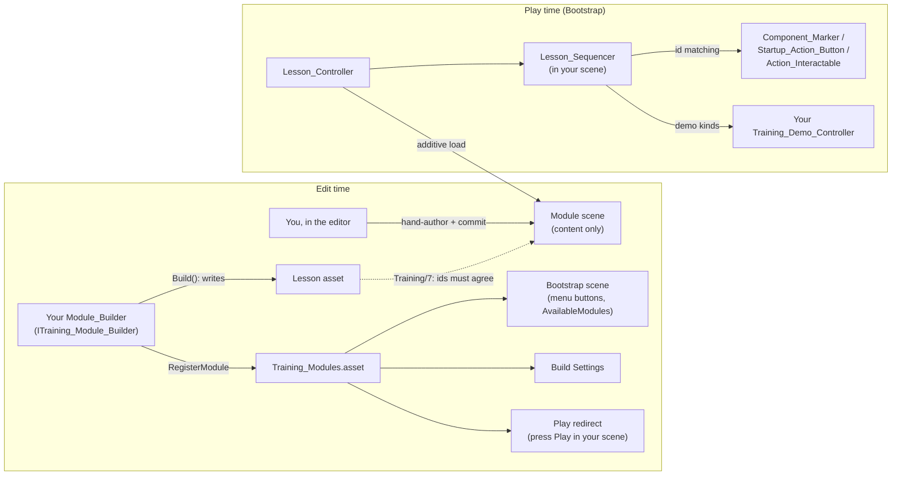

# VR Training Module Framework — HOWTO

How to build your own training module on the shared framework. The lesson
engine, editor tooling and prefabs are shared; your module is one hand-authored
scene + one lesson asset + one small builder script (lesson content +
registration), all inside `Assets/Members/<You>/`.

**Scenes are authored, not generated** (2026-07-27 decision,
`07_Scene_Authoring_Migration.md`): you build your scene in the editor and
commit it like any other scene. The builder writes the lesson asset and the
registry entry — nothing else — and **Training/7** validates that scene and
lesson agree, which is what generation used to guarantee.

## Where things live

| Location | Contents | Owner |
|---|---|---|
| `Assets/Scripts/Training/` | Runtime lesson engine (`Lesson_*`, `Module_Loader`, `Component_Marker`, `Marker_Registry`, `Action_Button_Registry`, `Startup_Action_Button`, `Action_Interactable`, `Panel_Tab_Group`, `Part_Highlighter`, `Marker_State_Toggle`, `Wrist_HUD`, `Face_Camera`, `Screen_Fader`, `Desktop_Click_Select`, `Training_Demo_Controller`, `Training_Module_Registry`) | shared — don't put module content here |
| `Assets/Scripts/Training/Editor/` | `Training_Builder_Core` (framework assets, Bootstrap scene, registry, lesson/step factories — plus legacy scene-generation factories that go away when M1 finishes migrating, `07_Scene_Authoring_Migration.md` §6–7), `ITraining_Module_Builder`, `Training_Validator` (Training/7), `Training_Debug` (play-mode drivers), `Training_Play_Redirect`, `Module_Builder_Template.cs.txt` | shared |
| `Assets/Training/` | Framework assets, built by `Training/1` and committed: `Prompt_Panel.prefab`, `Component_Marker.prefab`, `Marker_Glow.mat`, and **`Training_Modules.asset`** (the module registry) | generated (committed) |
| `Assets/Members/<You>/Training/Editor/` | Your `<Xn>_Module_Builder.cs` — lesson steps + registration, nothing else; `M2_Module_Builder.cs` is the model. Long lesson prose or debug menu items can split into sibling `partial` files (M1's `M1_Lesson_Content`, `M1_Debug_Menu`); member-wide paths go in one place (`Colin_Training_Paths.cs`). | you |
| `Assets/Members/<You>/Training/Lessons/`, `Scenes/` | Your lesson asset(s) and your hand-authored module scene — committed artifacts | you |
| `Assets/Members/<You>/Training/Scripts/` | Your module-specific runtime scripts (e.g. Colin's `Mill_Demo_Controller`, `Startup_State_Controller`, `Door_Click_Toggle`) | you |

## How it fits together

Runtime flow: `Lesson_Controller` (Bootstrap, persistent) additively loads your
scene, finds its `Lesson_Sequencer`, and runs your `Lesson_Definition` steps —
Guided first (highlights on), then Practice (the `Include_In_Quiz` steps,
scored against `Quiz_Pass_Threshold`), then results + save. Steps connect to
scene objects purely by **string id**: a `Select_Component` step advances when
the `Component_Marker` with the matching `Marker_Id` is clicked; a
`Panel_Action` step when the matching `Action_Id` fires. Desktop mouse clicks
work automatically (`Desktop_Click_Select` raycasts when no headset is active).

## Creating a module

1. **Builder.** Model it on `M2_Module_Builder.cs`: implement
   `ITraining_Module_Builder`, pick the next free `Order` (M1 = 0, M2 = 1 —
   builders run in `Order`, and the registry list, which is the menu and
   build-settings order, appends in that order on first registration).
   `Build()` writes the lesson asset (`LoadOrCreateLesson` + the `Info` /
   `Select` / `PanelAction` factories from `Training_Builder_Core`) and calls
   `RegisterModule(lesson, scenePath)`. Give it its own
   `[MenuItem("Training/3<x> Build <Xn> Lesson")]` so the lesson can be rebuilt
   without running every builder. (`Module_Builder_Template.cs.txt` still shows
   the pre-migration shape — ignore its `BuildScene()` half.)
2. **Author the scene by hand** in your `Scenes/` folder — fastest start is
   copying an existing module scene and swapping the content. What it must
   contain (exactly the contract `Training/7` checks):
   - your machine/props;
   - a `Lesson_Manager` object with a `Lesson_Sequencer`, every slot filled:
     `PromptPanel` (instance of `Assets/Training/Prefabs/Prompt_Panel.prefab`;
     `PromptText` / `ContinueButton` are its children), `ResultsPanel` +
     `ResultsText` + `RetryButton` + `ReturnButton` (a world-space canvas — no
     prefab, copy one from an existing scene), and `Registry` (a
     `Marker_Registry` — required even if the module has no Select steps);
   - for `Select_Component` steps: the `Marker_Registry` (`MarkersRoot`,
     `Sequencer`) and, under `MarkersRoot`, instances of
     `Assets/Training/Prefabs/Component_Marker.prefab` sized over each part,
     `Marker_Id` = step id; plus a `Part_Highlighter` (`Sequencer`, `Registry`)
     for the guided-mode glow;
   - for `Panel_Action` steps: an `Action_Button_Registry` (`ButtonsRoot`,
     `Sequencer`) and, under `ButtonsRoot`, UI buttons carrying
     `Startup_Action_Button` (`Action_Id`, `Highlight` frame) or clickable
     machine parts carrying `Action_Interactable` (`Action_Id`, `BoundingBox`,
     trigger `BoxCollider` + `XRSimpleInteractable`);
   - for demo step kinds: your `Training_Demo_Controller` subclass, assigned
     to the sequencer's `DemoController`.

   Gotcha: `XRSimpleInteractable` skips trigger colliders when auto-filling
   its Colliders list — add the trigger box to the list yourself or ray clicks
   never land. (The `Component_Marker` prefab already carries this; hand-built
   `Action_Interactable`s need it done manually.)
3. **Register + plumb.** Run your builder's menu item, then **Training/2 Build
   Bootstrap Scene** + **Training/4 Add Scenes To Build Settings**. Your module
   appears as a Bootstrap menu button. Commit the scene, lesson asset,
   `Training_Modules.asset`, the rebuilt Bootstrap scene and
   `ProjectSettings/EditorBuildSettings.asset` — teammates then get the module
   by pulling, nothing to rebuild.
4. **Validate: Training/7 Validate Open Module Scene**, with your scene open,
   after every scene or lesson edit. Ids match by string at runtime and a
   mismatch is silent (a step that can never complete), so the validator is
   what stands between a typo and a broken module. It cross-checks every step
   target against the markers/actions reachable from the registry roots, and
   flags duplicate ids, markers outside `MarkersRoot`, empty sequencer slots,
   a missing demo controller, and scenes missing from the registry. Deliberate
   wrong-answer buttons are named `distractor_*` to skip the unused-id warning.
5. **Test without a headset**: open your scene and press Play — the redirect
   boots Bootstrap and auto-enters your module. Use the **Training/8 Debug**
   menu items (`Auto Step`, `Auto Run To Completion`, wrong-answer, retry) to
   drive the flow, and left-click markers/buttons directly.

## Custom step kinds (demos, animations)

- `Info`, `Select_Component` and `Panel_Action` are handled by the sequencer.
  **Every other kind** is handed to the scene's `Training_Demo_Controller`
  subclass via `Play(step)`; call `Raise_Demo_Finished()` when your demo ends.
- Need a new kind (e.g. `Lathe_Demo`)? **Append it to the end** of
  `Lesson_Step_Kind` — it serializes as an int, so reordering corrupts every
  existing lesson asset. The sequencer needs no changes.

## Rules & gotchas

- **Scenes are authored artifacts — commit them.** No builder touches your
  scene, and nothing keeps scene and lesson in sync automatically anymore:
  run `Training/7` after edits instead of trusting that the ids still agree.
- **Transitional, until `07_Scene_Authoring_Migration.md` §6 lands:** M1 is
  still on the legacy generated path, so `Training/3`, `Training/5` and
  **`Training/0`** (it runs every builder, M1's scene build included) overwrite
  `Module1_Overview.unity` and the hand edits in it. Leave them alone unless
  you are deliberately working on M1.
- **One scene per module, in your own `Members/<You>/` folder** — that's the
  merge-safety model (see `00_Program_Overview.md` §6); `.gitattributes` routes
  residual scene conflicts through Unity Smart Merge. Module scenes are
  content-only: no XR rig, camera, EventSystem or managers (Bootstrap has them).
- **Don't edit shared files** (`Assets/Scripts/Training/`, `Training_Builder_Core`)
  for module content. The only shared things you touch are appending to
  `Lesson_Step_Kind`, and the registry asset your builder writes automatically.
- **Everything compiles into one Assembly-CSharp** — class names are global, so
  prefix module-specific scripts distinctively (`Lathe_...`, `ASRS_...`).
- Placeholder menu buttons ("coming soon"): add an entry to
  `Assets/Training/Training_Modules.asset` in the Inspector with no Lesson and a
  `Placeholder_Label`, then rebuild Bootstrap (`Training/2`).
- If a module someone just pushed is missing from your Bootstrap menu, they
  forgot to commit the rebuilt Bootstrap scene or the registry — run
  `Training/2` + `Training/4` locally.
