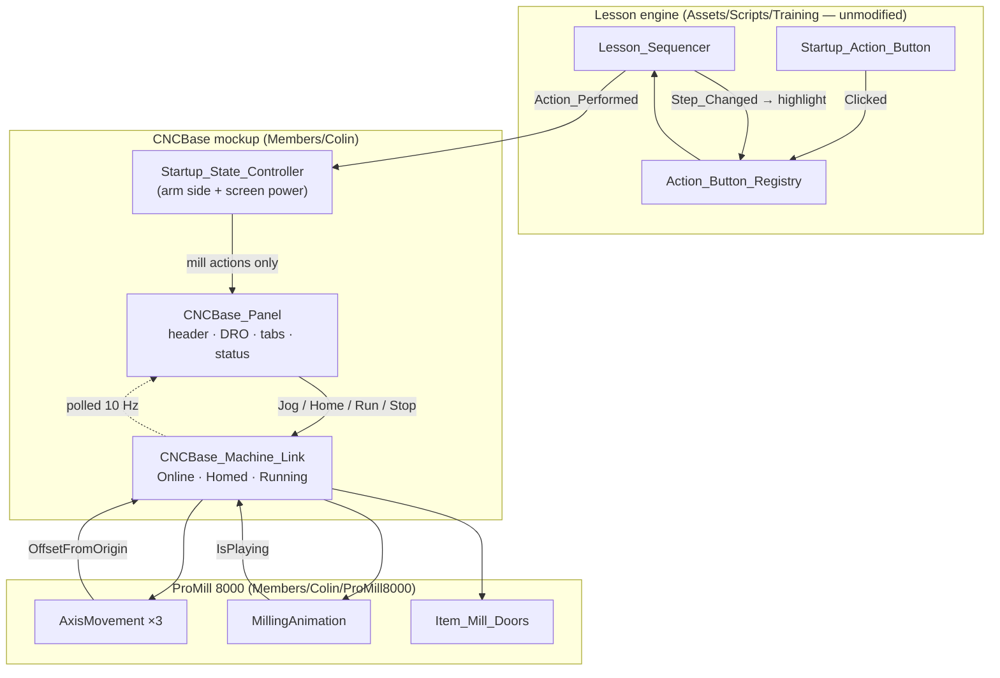

# 02 — Architecture

Two new runtime scripts, one optional third, and a shrink of `Startup_State_Controller`. **No changes to
`Assets/Scripts/Training/`** — the lesson engine, registries and step kinds are untouched.

---

## 1. Components

| Script | Location | Responsibility | Knows about |
|---|---|---|---|
| `CNCBase_Machine_Link` | `Members/Colin/Training/Scripts/` | **The only component allowed to touch the mill.** Owns machine state (`Online`, `Homed`, `Running`), converts machine-axis commands into `AxisMovement` calls, reports positions in mm. | `AxisMovement`, `MillingAnimation`, `Item_Mill_Doors` |
| `CNCBase_Panel` | same | **The only writer of CNCBase readouts.** Header/DRO refresh, tab state, button → link dispatch, status/alarm text. | `CNCBase_Machine_Link`, TMP/UI refs |
| `CNCBase_Spindle` *(optional, §7)* | same | Rotates `SM_Rotating` while the spindle is on. | nothing |
| `Startup_State_Controller` | same *(existing, edited)* | Keeps the arm/SCORBASE side and screen power. Mill `case` bodies become one-line forwards to `CNCBase_Panel`. | gains a `CNCBase_Panel` ref, loses its mill text refs |

Why the split: the link is testable and re-targetable (a handwheel, a pendant, or M4's robot could drive it),
the panel is disposable UI. It is also the seam the promotion path cuts along — `03_Build_Plan.md` §5.

## 2. Data flow



Two directions, kept strictly apart:

- **Commands go down** — a click becomes an `Action_Id`, the sequencer validates order and raises
  `Action_Performed`, the panel translates it into a link call, the link moves metal.
- **State comes up by polling** — the panel reads the link every ~0.1 s. No events, no dirty flags. The
  machine is the source of truth; the panel is a view. This is what makes "the DRO can't lie" true.

Note the panel never subscribes to `Lesson_Sequencer` directly. It stays behind
`Startup_State_Controller`, so there is still exactly one component translating lesson events into scene
effects — the pattern the module already uses.

## 3. Machine ↔ world axis mapping (the #1 error source)

**Verified in `M1_Module_Builder.cs:176-197`, not from the model's node names — those lie.**

| Machine axis | Node | `AxisMovement.axis` (Unity) | Limits (m) | Travel | Speed |
|---|---|---|---|---|---|
| **X** — table, left/right | `Worktable_Base/WB_XAxis_Drive` | **X** | −0.14 … +0.14 | 280 mm | 0.05 |
| **Y** — saddle, fore/aft | `Worktable_Base/WB_YAxis_Drive` | **Z** | −0.076 … +0.076 | 152 mm | 0.05 |
| **Z** — spindle, up/down | `SpindleBase/SpindleMotor` | **Y** | −0.27 … 0 | 270 mm | 0.1 |

Rules:

1. The mapping is declared **once**, as three serialized fields on `CNCBase_Machine_Link` named
   `Machine_X`, `Machine_Y`, `Machine_Z`. Nothing else in the mockup may reference a Unity axis.
2. The builder resolves them the way M1 already does — off `MillingAnimation`'s serialized refs
   (`worktableX` → machine X, `worktableZ` → machine Y, `spindleY` → machine Z), never by
   `AddComponent`-ing new `AxisMovement`s.
3. `MillingAnimation`'s field names are **Unity**-axis names; the `Mill_Demo_Controller` field names are
   **machine**-axis names. Both are correct in their own frame. Do not "fix" either.

```
mm = AxisMovement.OffsetFromOrigin * 1000f
```

1 Unity unit = 1 m throughout. Y (saddle) carries the X stage via `dependents`, so jogging Y drags the
table in world Z — but X reads its own world-X offset, so the two DRO figures stay independent. Verify this
in P1 rather than assuming it.

## 4. `AxisMovement` gotchas that shape the code

| API | Behavior | Consequence for jog |
|---|---|---|
| `MoveBy(delta)` | **Instant.** Applies the position this frame. | ❌ Do not use for jog — the table teleports. |
| `MoveToTarget(world)` / `MoveToOffset(offset)` | Sets a target; `Update` interpolates at `speed`. | ✅ Jog = `MoveToOffset(OffsetFromOrigin + step)`. |
| `OffsetFromOrigin` | Relative to the position captured in **`Awake()`**. | Module scenes load additively, so "origin" is the builder-authored pose, **not** a real machine home. Home must mean `ResetToOrigin()`, and the DRO must show `---` until `Homed`. |
| `Clamp` | Applied by both move paths when `enableLimits`. | The panel does not need its own travel math — read `IsMoving` and compare requested vs actual to detect a limit hit. |
| `IsMoving` | `true` only while a target is pending. | The panel's "in motion" indicator and the Run gate both poll this. |
| `speed` | Private serialized. | Feed override needs either a public setter added to `AxisMovement` (a shared-file edit — avoid) **or** the link reproducing the move as a coroutine. **Recommendation: skip feed override in v1**; revisit when `Turn_Knob` lands and the shared-file edit is justified by two callers. |

`MillingAnimation.Play()` issues absolute `MoveToOffset` calls, so a program run from a jogged position
converges correctly. It still must be gated behind `Homed` — that is control behavior, not a technical need.

## 5. `CNCBase_Machine_Link` surface

```csharp
public enum Machine_Axis { X, Y, Z }

// State
public bool Online   { get; }   // false in Simulation — motion commands are accepted and dropped
public bool Homed    { get; }
public bool Running  { get; }
public bool Powered  { get; }   // mill_power_on AND mill_pc_on
public string Alarm   { get; }  // "" when clear

// Commands (all no-op with a reason when the gate fails)
public void Set_Online(bool online);
public void Home();                              // ResetToOrigin ×3, sequential, sets Homed
public void Jog(Machine_Axis axis, float mm);    // MoveToOffset(current + mm)
public void Run(string program);                 // start_fms.nc → wait-loop; part_042.nc → MillingAnimation
public void Stop();
public void Doors(bool open);
public void Spindle(bool on);

// Readback
public float Position_mm(Machine_Axis axis);
public bool  Is_Moving(Machine_Axis axis);
public float Run_Seconds { get; }
public string Current_Block { get; }
```

Every command runs the same gate chain and writes `Alarm` on rejection:

```
Powered? → Homed? (jog/run only) → Online? → soft limits
```

Rejections are **silent to the machine and visible on the status line**. That single rule is what makes
Simulation, un-homed jog, and limit overrun all teach without any special-casing in the UI.

## 6. Changes to `Startup_State_Controller`

Currently `OnActionPerformed` has 14 cases; six touch the mill and format strings directly
(`cncbase_launch`, `cncbase_online`, `cncbase_home`, `run_start_fms`, `verify_mill`, plus the
`mill_pc_on` / `mill_power_on` power pair). After:

- Mill cases become `Panel.On_Action(actionId)` — one line each. The panel decides what that means.
- `MillStatus` / `MillReadout` serialized refs move to `CNCBase_Panel`; the state controller drops them.
- `MillScreen` (the `CanvasGroup`) and `MillPowerPart` **stay** with the state controller — they are
  station props, not software — but both now also call `Link.Set_Powered(...)`.
- `Reset_Cold()` gains `Panel.Reset()`, which calls `Link.Reset()`: `MillingAnimation.Stop()`,
  `ResetToOrigin()` ×3, doors closed, `Homed = Online = Running = false`, alarm cleared.

Net: the file gets shorter, and the arm half is untouched. This is the diff that keeps "one writer" true.

## 7. `CNCBase_Spindle` (optional)

```csharp
// Spins SpindleBase/SpindleMotor/SM_Rotating while on. RPM is display-only —
// visual rate is capped so it doesn't strobe at 60 Hz.
void Update() { if (on) t.Rotate(axis, visual_deg_per_sec * Time.deltaTime, Space.Self); }
```

Local rotation axis must be read off the model, not assumed. If this is cut, `01_Screen_Spec.md` §5 says
the spindle becomes a read-only Setup row — never a dead button.

## 8. Builder work (`M2_Module_Builder.cs`)

Scenes are generated; all of the above is authored in `BuildScene()`. Existing helpers cover most of it:

- `CreateWorldCanvas` / `AddBackground` / `CreateTMP` / `CreateButton` — header and rows.
- `BuildTabContent` + `Panel_Tab_Group` — grows from 2 tabs to 4. Registry `Reveal(id)` keeps guided
  highlighting working across the new tabs with no change.
- `BuildActionButton` — unchanged for every graded control.
- Jog buttons are plain `CreateButton` + a listener the panel adds at runtime (no `Action_Id`, so
  `Action_Button_Registry` correctly ignores them).
- `SetRef` / `SetRefArray` — wire the link's three axes off `MillingAnimation`'s serialized refs, exactly
  as `M1_Module_Builder.cs:184-186` already does.

The canvas is 520×460 px. Four tabs plus a 5-row header will not fit at the current density —
**increase to 640×560 and drop the scale to ~0.00075** so the physical size on the monitor is unchanged,
then bake the tuned transform back into the builder before rebuilding.

## 9. What is deliberately not built

- **No new `Lesson_Step_Kind`.** Everything is `Panel_Action`. The enum serializes as an int; appending is
  the only safe change and nothing here needs one.
- **No edits to `Assets/Scripts/Training/`.** The one temptation is a public `speed` setter on
  `AxisMovement` for feed override — deferred (§4).
- **No second HUD.** Status and alarms live on the panel; the wrist HUD keeps owning lesson progress.
- **No save-state changes.** Machine state is per-session and resets cold; `Lesson_Controller` keeps
  owning persistence.
