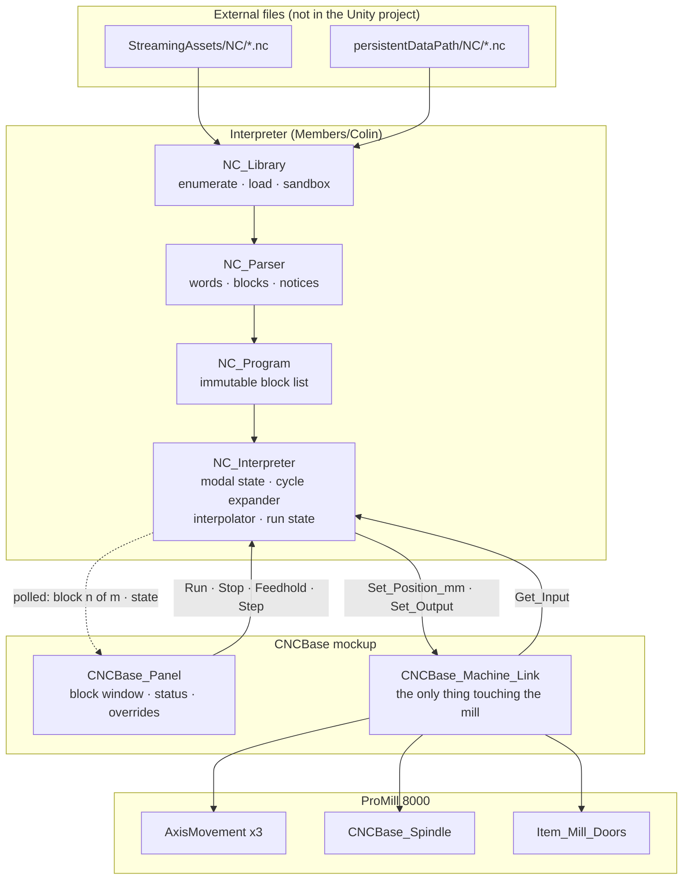

# 05 — NC Program Interpretation (G-Code) at the Mill Station

How the ProMill 8000 station **reads an external `.nc` file and executes it**, so the mill's motion is
produced by the program the trainee selected rather than by a coroutine that always does the same thing.

**Read and run only. Nothing in this document authors, edits, renumbers, or writes G-code.** §1 argues why
that is not a reopening of the dropped roadmap item.

Companion to `README.md` (scope rule), `01_Screen_Spec.md` (the panel), `02_Architecture.md` (the machine
link), `04_CNCBase_Reference.md` (what CNCBase really is). The carving half — what happens to the *metal*
when the tool passes through it — is `docs/Stations/01_Material_Transformation_Research.md`; §5.3 explains
why these two are complementary and not competing.

**Confidence marks:** 🔴 = unverified, needs the lab machine or a measurement in this repo. Everything else
is sourced to Intelitek documentation or read directly out of this codebase.

---

## 0. The short version

1. **The dialect is fully documented and we now have it.** `User_Guide_ProMill_8x00_C.pdf` §8–§9 and §12 are
   a complete NC reference for this exact machine — address characters, G-code groups, M-code table, canned
   cycles, and the FMS handshake protocol. §2 transcribes it. This is the document `04_CNCBase_Reference.md`
   §0 said we could not get for the *software*; the *machine* manual carries it.
2. **`start_fms.nc` is no longer a guess.** The manual ships a sample called `START.NC` that does exactly
   what the lab's file is named for, and it is not a wait-loop — it is a **ready-signal plus chain-to-file
   dispatch loop**. §4. This closes the largest open question in three of our docs, with one caveat.
3. **The blocker is not parsing, it is motion.** `AxisMovement` is a per-axis point-to-point mover. Three
   axes each running `Mathf.MoveTowards` at their own `speed` produce a dogleg, not a straight line, and
   cannot produce an arc at all. G01 and G02/G03 need a coordinated interpolator. §6.
4. **The fix inverts a rule from `02_Architecture.md` §4, correctly.** That doc says never use `MoveBy` —
   true for a jog button, wrong for an interpreter. `MoveBy` is the per-frame integration step, and it is
   the only existing API that keeps `dependents` and soft-limit `Clamp` working. §6.2.
5. **Ship a scope-reduced code set, by the same rule the panel uses.** A code ships iff executing it changes
   something visible on the mill in the scene. That is ~22 codes in, ~40 out. §3.
6. **Files live in `StreamingAssets/NC/`, with a `persistentDataPath/NC/` overlay** so an instructor can drop
   a program in without Unity. Chain targets resolve by basename inside that root and never by the path
   written in the file. §8.
7. **This makes three already-specified panel features real** — the block window (`04` C7), the feed-rate
   override (`04` C5, which `02_Architecture.md` §4 had to defer), and the Operator Panel's Feedhold /
   Single Step / Optional Stop. None of them have anything to act on until a program exists. §9.

---

## 1. Read vs. write — why this does not reopen a closed decision

`00_Program_Overview.md` §1 records the June 2026 restructure: **G-code writing was dropped from the
roadmap.** `README.md` §3 correctly follows it, ruling the NC editor, block numbering and comment management
**OUT**. Both stand, unchanged.

What was dropped is **authoring as curriculum** — a trainee is never asked to write NC code. What M2 already
claims to teach is the opposite side: step 13 is `run_start_fms`, *"Open → select `start_fms.nc` → Run
Program"* (`03_Module2_Startup_Plan.md` §step table). Running an NC program is already in scope, already
scripted, already assessed. Today it is a status string.

So the honest framing is not "add G-code to the project." It is: **M2 asserts the mill runs an NC program;
this makes the assertion true.**

Two supporting facts:

- Intelitek's own ProMill 8000 course (`04_CNCBase_Reference.md` §5.2) puts *Running a Program* at module 7
  and *Fundamentals of NC Programming* last. Executing before authoring is their sequence too.
- `01_Material_Transformation_Research.md` §10 lists "a G-code interpreter" under *what I would not build* —
  and its reason is exact: **"Not needed to carve."** That is a statement about the carving layer, and it is
  right. §5.3 shows the interpreter is a *motion source*, which is the thing that document's §6.2 explicitly
  wants more of.

**The counter-argument, stated plainly.** An interpreter is real engineering to replace an animation that,
at M2's fidelity, nobody would catch. If the only payoff were "the pocket cycle is now data," this would not
be worth building. §11 is honest about which stage pays for itself; §10 lists the cheaper alternative that
loses least.

## 2. The dialect, as documented for this machine

Source **S1** = [`User_Guide_ProMill_8x00_C.pdf`](https://downloads.intelitek.com/Manuals/CNC/Machines/User_Guide_ProMill_8x00_C.pdf),
the same document `04_CNCBase_Reference.md` rates **High**. Section numbers below are its own.

### 2.1 Grammar

> "An NC program is composed of blocks (lines) of code. Each block contains a string of words. An NC word is
> a code made up of an alphabetic character (called an address character) and a number." — S1 §8.1

So the parser is a tokenizer over `letter + signed decimal`, plus `;` to end-of-line as a comment. There is
no expression syntax, no variables, no macro-B. S1 §8.2 adds three rules that matter:

| S1 §8.2 rule | Consequence for the parser |
|---|---|
| Word order within a block must be `%, \, /, N (O), G, X (U), Z (W), I, K, R, Q, L, F, M, S, T, P, ;` — "a different order may cause unpredictable results" | Do **not** enforce it. Parse order-independently, and treat a violation as a lint warning at load, not a runtime alarm. Refusing to run a file the real machine would run is worse than being lenient. |
| Words are **modal** — "the system assumes no change in codes unless a new code appears" — except `N, I, K, G04, G05, G25, G26, G92, F-as-dwell, M02, M20, M25, M26, M30, M47, M98, M99` | The executor carries modal state across blocks. That exception list is the authority for which words are one-shot; hard-code it, don't guess. |
| One G code per group per block; M codes should get their own block | Group membership must be a table, because "multiple G codes in a block" is legal and common (`N1G90G01X.5Y.5Z1.5F1` is S1's own example). |

### 2.2 Address characters (S1 §8.4, complete)

| Word | Meaning | Word | Meaning |
|---|---|---|---|
| `%` | Incremental arc centers (Fanuc mode), file-wide | `N` | Block number — user reference only |
| `$` | Absolute arc centers (EIA-274 mode), file-wide | `O` | Subprogram start label |
| `\` | Skip | `P` | Subprogram ref / dwell seconds in canned cycles |
| `/` | Optional skip, `/n` = every *n*th pass | `Q` | Depth of cut; peck depth (always positive) |
| `F` | Feed rate in **units/min** — *and* dwell **seconds** with `G04` | `R` | Canned-cycle reference plane; rotation angle with G68 |
| `G` | Preparatory codes | `S` | Spindle speed |
| `H` | **Input/output selection number**, default `H1` | `T` | Tool selection |
| `I`,`J`,`K` | Arc centre X, Y, Z | `U`,`V`,`W` | Incremental X, Y, Z motion |
| `L` | Loop counter; arc angle resolution | `X`,`Y`,`Z` | Axis coordinates |
| `D` | Cutter-compensation offset table entry | `;` | Comment to end of line |

**The `F` trap.** S1 §8.4.5: `F3` is 3 in/min or 3 mm/min depending on units — but with `G04`, `F` is
*seconds*, and S1 states you therefore "cannot also specify a new feed rate in the same block." An
interpreter that updates modal feed on every `F` will silently set the feed to 10 mm/min after `G04F10`.

### 2.3 G-code groups (S1 §8.4.6, complete)

| Group | Codes |
|---|---|
| Interpolation | `G00 G01 G02 G03 G101` |
| Units | `G70` inch · `G71` metric · `G20` `G21` Fanuc equivalents |
| Wait | `G04` dwell · `G05` pause · `G25` wait input high · `G26` wait input low |
| Canned cycle | `G32 G72 G73 G77 G79 G80 G81 G83` (+ `G82 G84 G85 G86 G89` per §9.6) |
| Programming mode | `G90` absolute · `G91` incremental |
| Preset position | `G28 G29 G92 G96 G98 G99` |
| Coordinate systems | `G54 G55 G56 G57 G59` |
| Polar | `G15 G16` |
| Compensation | `G39 G40 G41 G42` (+ `D`) |
| Scaling | `G50 G51` |
| Rotation | `G68 G69` |
| Plane selection | `G17 G18 G19` |

### 2.4 M codes (S1 §8.4.12, complete)

| Subgroup | Codes |
|---|---|
| Program stop/end | `M00` pause · `M01` optional stop · `M02` end · `M30` end (= M02) |
| Spindle / axis motors | `M03` spindle on · `M05` spindle off · `M38` drive motors standby |
| Tool change | `M06` |
| I/O | `M25` set output high (with `H#`) · `M26` set output low (with `H#`) |
| Program management | `M20` chain to next program · `M22` write position to file · `M47` rewind · `M98` call subprogram · `M99` return / goto · `M105` operator message |
| Homing | `M111` home X · `M112` home Z |

S1 §8.4.12 also gives the execution-order rule, which is not cosmetic: **device-on M codes execute at the
*start* of that block's motion; device-off M codes execute *after* it completes.** `M03` on a move block
means the spindle is already turning as the cut begins.

### 2.5 ⚠ This manual has lathe contamination

Three places give it away: the homing group has only **`M111` X and `M112` Z** with no Y; `M22` is described
as writing "the current X and Z machine coordinates"; and the polar-programming worked examples in §8.4.6.8
use `X`/`Z` as the plane pair while the §8.1 example correctly uses `X`/`Y`/`Z`. The `8x00` guide is shared
across a product line that includes the ProTurn lathes.

**Rule for this project:** trust the manual for *code existence and semantics*; do not trust it for
*axis-letter assignments* where they contradict a 3-axis mill. Cross-check anything axis-shaped against
`04_CNCBase_Reference.md` §5 and the scene. 🔴 Whether the lab's mill exposes an M-code to home Y is
unknown; `Setup | Set/Check Home` is the path we already model.

## 3. The scope-reduced code set

`README.md` §2's rule, applied to G-code:

> A code ships **iff** executing it changes something the trainee can see on the ProMill 8000 in the scene,
> **or** it sets state a shipped readout displays.

Everything else parses to a recognised-but-ignored word with a load-time notice — never a silent no-op, and
never a hard error that refuses to run a legal file.

### Tier 1 — motion and modality (the minimum that makes a program run)

| Code | In-scene effect | Note |
|---|---|---|
| `G00` | Rapid to X/Y/Z | Non-coordinated is fine and free — §6.3 |
| `G01` | Coordinated linear feed at `F` | Needs the interpolator — §6.2 |
| `G90` / `G91` | Absolute / incremental | Modal; drives the coordinate math in §7 |
| `G70` `G71` `G20` `G21` | Unit override for the rest of the file | Feeds the one conversion in §7 |
| `G04` | Dwell — no motion, clock runs | The `F`-is-seconds trap, §2.2 |
| `G05` / `M00` | Pause until Run/Continue | Real Operator Panel button — `04` §3.3 |
| `M01` | Optional stop, honours the panel toggle | ditto |
| `M02` / `M30` | End of program; spindle and outputs off | S1: "turns off drive motors, and all outputs" |
| `M03` / `M05` | Spindle on / off | Requires `CNCBase_Spindle` — `02_Architecture.md` §7. `04` C11 already says build it |
| `F` `S` `T` | Feed, spindle speed, tool | `S` and `T` are Machine Info readouts (`04` §3.6) |
| `N` · `;` · `%` `$` | Block number, comment, arc-centre mode | `%`/`$` are stored, consumed by Tier 2 |
| `/` `\` | Optional skip / skip | Honours the panel's Optional Skip toggle |

### Tier 2 — geometry the mill can actually make

| Code | In-scene effect | Why it earns its place |
|---|---|---|
| `G02` / `G03` + `I` `J` | Clockwise / counter-clockwise arc in XY | Without arcs every program is a rectilinear toy. M1 teaches **contour** as one of the five operations |
| `G17` | XY plane | Accept and require; `G18`/`G19` are in the cut list below |
| `G81` `G82` `G83` + `R` `Q` `K` `P` | Straight / dwell / peck drilling | M1 teaches **drill** as one of the five operations |
| `G80` | Cancel canned cycle | Also implied by `G00`/`G01` per S1 §9.6.1 |
| `G98` / `G99` | Retract to initial plane / to R | One boolean inside the cycle expander |
| `G28` | Home | Maps to the `Home()` the link already has |
| `G92` | Preset position | The program-side twin of `Setup \| Set Position` |
| `G54`–`G59` | Work coordinate system select | A 6-entry offset table. 🔴 Probably only `G54` is used |

### Tier 3 — the FMS handshake (this is what M2 is actually about)

| Code | In-scene effect |
|---|---|
| `M25 H#` / `M26 H#` | Set a cell output high / low — the mill telling the robot it is ready, or driving the door / vise |
| `G25 H#` / `G26 H#` | Block until an input goes high / low — the mill waiting on the robot, the door sensor, the vise |
| `M20` + next line | Chain to another program, or to a **chain file** — §4 |
| `M105 (text)` | Operator message on the panel; `!` prefix pauses, `~` marks it a warning |

`M105` is display-only and **never graded**. Lesson content is authored in `M2_Lesson.asset`
(`05_Module_Framework_HOWTO.md`); an `.nc` file must not become a second, invisible authoring channel for
assessed steps.

### Cut, with the reason

| Code(s) | Why out |
|---|---|
| `G39 G40 G41 G42` + `D` | Cutter compensation needs a real offset table and path-offsetting geometry, and the result is invisible without measuring the part. One tool is modelled (`01_Screen_Spec.md` §7) |
| `G15 G16` polar · `G50 G51` scaling · `G68 G69` rotation | Coordinate transforms with no in-scene consequence beyond a different path — genuine cost, zero teaching value at M1–M3 |
| `G18 G19` | Arcs in ZX/YZ. The scene's demo geometry is flat-bottom pocketing |
| `G84 G85 G86 G89` | Tapping and boring cycles. No tap, no boring head, one Ø tool |
| `G101` `G32 G72 G73 G77 G79` `G96` `G31` | Undocumented in S1's detail sections or hardware we do not model (probing, constant surface speed) |
| `M06` tool change | One tool modelled. `T` sets the readout and nothing moves |
| `M22` write position to file | **The interpreter never writes to disk.** §8.4 |
| `M38` drive standby · `M47` rewind | No visible state; `M47` invites accidental infinite loops |
| `M98` `M99` + `O` `P` `L` subprograms | Deferred, not rejected. Real, and the sample programs in §4 do not need them. Revisit if a lab file uses them 🔴 |
| `M111` `M112` | See §2.5 — do not implement an axis-letter mapping the manual gets wrong |

**Count: ~22 codes in Tiers 1–2, plus 4 handshake codes. ~40 cut.** That ratio is the point — the same
ratio `README.md` §3 achieved for the panel.

## 4. `start_fms.nc` — the answer, and the caveat

`README.md` §7.4, `03_Build_Plan.md` §4, `03_Module2_Startup_Plan.md` §checklist and
`01_Material_Transformation_Research.md` Q5 all list this as the largest open unknown, modelled as "a
no-motion wait-loop."

S1 §12.3 ships a worked robot↔CNC communication sequence. Its first program is:

```gcode
;-------------------------------------------
; First program to run
;-------------------------------------------
M25 H11 ;USER OUT#1 ON
M20;CHAIN TO PROGRAM
CHAIN_FILE O:\project_name\WS3\MILL\CHAIN_FILE.TXT
```

Read it: **raise user output #1 so the robot's input reads "mill idle and ready", then chain to a file whose
*contents* name the next program to run, and block there.** S1 §12.1.3 calls these the "CHAIN TO FILE and
CHAIN to COM G Codes," which "allow the ProMill 8000 to receive string information. An external control
device, such as a robot or device driver, can run any CNC program via this interface."

Every task program in the sample has the same shape — drop the ready flag, do the thing, chain back:

```gcode
; ODOOR.NC — open the guard door
M26 H11  ;USER OUT#1 OFF          ← "busy"
M25 H102 ;OPEN DOOR               ← drive the door output
G04F2    ;MAKE SURE OUTPUT IS SEEN ← 2 s dwell so the edge is observed
G25 H132 ;Wait door open           ← block on the door-open sensor
M20      ;CHAIN TO PROGRAM
START.NC                           ← back to ready
```

```gcode
; PLACE.NC — move the vise to the loading position
M26 H11 ;USER OUT#1 OFF
G00 X-160 Y-20 Z160
G04F1   ;MAKE SURE OUTPUT IS SEEN
M20     ;CHAIN TO PROGRAM
START.NC
```

### What this changes

| Where | Says today | Should say |
|---|---|---|
| `03_Module2_Startup_Plan.md` §3, step 13 | "the mill enters a wait-loop, ready for cell commands" | Directionally right, mechanically wrong. It is a **dispatch loop**: the mill signals *ready*, then executes whatever program the cell names next. The mill is the **slave**; SCORBASE is the master (S1 §12.3, verbatim) |
| `01_Screen_Spec.md` §6 | "`start_fms.nc` → **No motion.** Sets `Running` + wait-loop state" | Still correct on screen — no motion — but the status line can now be true rather than canned: `RUNNING start_fms.nc — OUT#1 HIGH, waiting for cell command` |
| `README.md` §7.4 | 🔴 Still open | **Downgraded to a confirmation.** We know the shape; we do not know the file |

### The caveat, kept honest

`START.NC` is **Intelitek's sample**, not the lab's file. `start_fms.nc` is named for FMS and behaves like
this family, but the checklist item survives — reworded from *"what does it do?"* to *"does it contain
`M25`/`M20`/`CHAIN_FILE`, and what are the H numbers?"* That is a thirty-second read once someone opens the
file, and it is now a yes/no question instead of an open one.

**Observed H numbers, from Intelitek's own sample** 🔴 — the lab's I/O map may differ, and one row is
Intelitek's own inconsistency, reproduced rather than tidied:

| H | Sample usage | Note |
|---|---|---|
| `H11` | User output #1 — the mill's "idle/ready" flag to the robot | Used in every sample program |
| `H102` | Output — open door | |
| `H132` | Input — door open confirmed | The interlock in S1 §4.5 has a sensor |
| `H4` | Output — vise | Sample file `OVICE.NC` ("open vice") contains `M26 H4;CLOSE VICE`. Label and comment disagree in the source. Do not guess which is right |

## 5. Architecture

### 5.1 Components

Three new scripts in `Assets/Members/Colin/Training/Scripts/`, per decision **D3**. **No changes to
`Assets/Scripts/Training/`**, and no changes to `AxisMovement` or `MillingAnimation`.

| Script | Responsibility | Knows about |
|---|---|---|
| `NC_Parser` | Text → `NC_Program`. Tokenises words, attaches comments, resolves `%`/`$`, expands nothing. **Pure C#, no `UnityEngine` types beyond `Vector3`** — unit-testable with no scene | nothing |
| `NC_Program` | Immutable parsed result: `NC_Block[]`, each with source line, words, and any load-time notices. Also the block list the panel displays | nothing |
| `NC_Interpreter` | Executes blocks. Owns modal state, the canned-cycle expander, the coordinated interpolator, the run state machine, and the signal table | `CNCBase_Machine_Link`, `NC_Program` |
| `NC_Library` | Enumerates and loads `.nc` files from the two roots in §8 | filesystem |

`CNCBase_Machine_Link` (`02_Architecture.md` §5) is **unchanged in role and gains three members**:

```csharp
// New — the interpreter's motion surface. Machine axes, millimetres.
public void  Set_Position_mm(Machine_Axis axis, float mm);  // MoveBy(delta) under the hood — §6.2
public void  Begin_Program_Motion();                        // Stop() x3: the link owns the axes, not Update
public void  End_Program_Motion();

// New — cell I/O for Tier 3
public bool  Get_Input(int h);
public void  Set_Output(int h, bool high);
```

It stays **the only component allowed to touch the mill**. The interpreter is a *client* of the link,
exactly as the panel is.

### 5.2 Data flow



The two rules from `02_Architecture.md` §2 survive intact: **commands go down, state comes up by polling.**
The interpreter adds one arrow and breaks neither.

### 5.3 Relationship to the material-transformation work

`01_Material_Transformation_Research.md` §6.2 — *"Drive the field from motion, not from intent"* — names
"a G-code interpreter" as one of four motion sources that would "carve for free," and its §10 rejects an
interpreter as *"not needed to carve."* Both are correct, and this design depends on both being correct:

- The height field samples **tool-tip pose from the `AxisMovement` transforms each frame**. It does not know
  or care what moved them.
- The interpreter never touches the field, never calls `Cut_Pocket`, and has no geometry API.

They compose without either importing the other. And that document's third consequence gets sharper: it
wants **motion-vs-intent divergence** as an assessment signal. With an interpreter, the intent is not a
synthesised op log — it is the trainee's own selected `.nc` file, block by block. *"The program said
`Z-5.0`; the tool went to `Z-8.0`"* becomes a diffable statement.

### 5.4 The other stations

CNCBase drives all four Intelitek benchtop machines (`04_CNCBase_Reference.md` §2), so `Item_Lathe`
(`Assets/Members/Alec/Item_Lathe.cs`, a `ProcessItem` stub) speaks the same dialect in a 2-axis X/Z frame —
which is precisely the contamination visible in §2.5's manual.

**Do not generalise now.** `03_Build_Plan.md` §5's rule holds: one caller does not justify a shared file.
Build the seam and stop:

- `NC_Parser` and `NC_Program` are already station-agnostic — they are text processing.
- `NC_Interpreter` binds to the machine through the link's five methods in §5.1. A lathe link implementing
  the same five is the entire port.
- Promotion trigger and checklist: `03_Build_Plan.md` §5, unchanged. `NC_Parser` moves; `NC_Interpreter`
  moves; the links stay with their stations.

## 6. The motion problem

**This is the part that is actually hard.** Everything else in this document is bookkeeping.

### 6.1 What `AxisMovement` does and does not do

Read `Assets/Members/Colin/ProMill8000/AxisMovement.cs`:

| Fact | Line | Consequence |
|---|---|---|
| `Update` runs `Mathf.MoveTowards(current, target, speed * dt)` **per axis, independently** | 43 | Three simultaneous `MoveToOffset` calls finish at three different times. The tool tip traces a dogleg, not a line. There is no coordination anywhere in the class |
| `MoveBy(delta)` applies the new position **this frame**, through `Clamp`, dragging `dependents` | 50–54, 77–90 | The only synchronous position write that keeps the vise, the workpiece and the soft limits correct |
| `MoveBy` does **not** clear `_targetPosition` | 50–54 | A jog still in flight will fight an interpreter writing the same axis, every frame, silently |
| `Clamp` is `_originPosition + minOffset … + maxOffset` | 107–112 | Soft limits come free — but silently. Requested ≠ actual is the only way to detect one |
| `speed` is private serialized, no setter | 11 | Irrelevant during a program run once the interpreter owns position — see §9.3 |

No arc, no coordination, no feed. That is not a defect; it is a point-to-point axis mover doing its job.

### 6.2 The `MoveBy` inversion

`02_Architecture.md` §4 says:

> `MoveBy(delta)` — **Instant.** Applies the position this frame. ❌ Do not use for jog — the table teleports.

**Correct for a jog button, and exactly backwards for an interpreter.** One button press = one `MoveBy` = a
teleport. Sixty `MoveBy` calls per second, each one frame's worth of a computed path, *is* smooth
coordinated motion — and it is the only way to get one, because `MoveToTarget` hands timing to the axis and
the whole problem is that the three axes must share timing.

The interpreter's inner loop:

```csharp
// Machine millimetres. One source of truth for where the tool should be this frame.
Vector3 p = Sample_Path(t);                       // lerp along a line, or a point on an arc
foreach (Machine_Axis a in Axes)
    Link.Set_Position_mm(a, p[a]);                // → AxisMovement.MoveBy(target - current)
```

**The ownership rule, and it is not optional.** Before the first block, `Begin_Program_Motion()` calls
`Stop()` on all three axes, clearing `_targetPosition` so `Update` early-returns at line 38 and the
interpreter is the sole writer. `End_Program_Motion()` releases. Skipping this produces a bug that looks
like physics — the table drifting toward a stale jog target while a program runs.

### 6.3 The three move types

| Move | Path | Duration | Implementation |
|---|---|---|---|
| **G00 rapid** | Whatever the axes do | slowest axis at rapid rate | **Use `MoveToOffset` and let the axes dogleg.** Real Fanuc rapids are commonly non-linear, the manual does not specify, and at these travels it is not visually distinguishable. Free, and it exercises the existing path |
| **G01 feed** | Straight line | `d / (F_eff / 60)` seconds | Coordinated interpolator, §6.2 |
| **G02/G03 arc** | Circle in XY | `r·abs(Δθ) / (F_eff / 60)` | Same interpolator over `θ(t)`; Z held or helical if a Z word is present |

Arc centre resolution follows the file's `%`/`$` mode (S1 §8.4.1–8.4.2): in `%` Fanuc mode `I`/`J` are always
**incremental from the start point**, regardless of G90/G91; in `$` EIA-274 mode they follow the current
G90/G91 mode. Getting this backwards puts the arc centre metres away — validate by comparing
`|start − centre|` against `|end − centre|` and raising `ALARM — arc geometry` past tolerance, which is what
a real control does.

**Canned cycles never reach the motion layer.** `G81`/`G82`/`G83` expand at execution into a sequence of
G00 and G01 primitives (rapid to XY → rapid to R → feed to Z, pecking by `Q` → retract per G98/G99). The
expander is a pure function from `(cycle, modal state, block)` to a list of moves, testable with no scene
and no Unity. Keep it that way.

### 6.4 Feed rates are honest and slow

S1 §8.4.5 recommends "up to 10 inch/min" for cutting — 254 mm/min, about **4 mm/s**. A 50 mm cut takes 12
seconds. The current `MillingAnimation` runs the table at `speed = 0.05` = 3000 mm/min, above the user
guide's *rapid* and near the datasheet's.

Do not quietly speed up the feed to make demos comfortable — that teaches a false machine. Run real-time,
expose a **demo time-scale** on the debug menu only (`Training/8 Debug - Toggle Time Scale 5x` already
exists), and if a lesson needs a short cycle, author a short program. 🔴 The rapid rate itself is
unsettled: 5000 mm/min (datasheet) vs 2000 (user guide) — `04_CNCBase_Reference.md` §5.1.

## 7. Coordinates and units

One conversion, in one place, or this goes wrong the way `README.md` §6's first risk row predicts.

| Layer | Frame | Units |
|---|---|---|
| `.nc` file | Work coordinates, machine axes | mm or inch, per `G70`/`G71`/`G20`/`G21` and `Setup \| Units` |
| `NC_Interpreter` | **Machine axes, always mm, always absolute** | mm |
| `CNCBase_Machine_Link` | Machine axes → Unity axes, the one declared mapping | mm in, metres out |
| `AxisMovement` | Unity axis offset from the `Awake()` pose | metres |

```
axis_offset_m = (program_mm  +  work_offset_mm[axis])  /  1000
```

with, in order of application: inch→mm if `G70`/`G20`; incremental→absolute if `G91`; `G54`–`G59` table
entry plus any `G92` preset.

Non-negotiables, carried from `02_Architecture.md` §3:

1. **The interpreter never names a Unity axis.** Machine X/Y/Z go to the link; the link's three serialized
   `AxisMovement` fields are the only place the mapping exists. `04_CNCBase_Reference.md` §2.5 and the
   model's misleading node names are why.
2. `mm = OffsetFromOrigin * 1000f`, 1 Unity unit = 1 m. Unchanged.

### The work origin 🔴

S1 §8.2 states the convention:

> "Part programs should reference the zero point with `X0Y0Z0` at the front left corner of the work piece."

So program coordinates are **work** coordinates and mostly positive, while the scene's X axis offset is
`±0.14 m` centred on the pose captured at `Awake()`. Something must map one to the other, and that something
is a serialized `Work_Origin_mm` on the link, measured to the front-left corner of the stock as it sits in
the vise.

This is a **measurement, not a decision** — and it is the interpreter's equivalent of the axis-mapping risk.
Symptom of getting it wrong: the program runs, the DRO is plausible, and the tool cuts air 140 mm from the
block. Verify criterion in §11 P2 exists to catch exactly this.

It also finally answers `README.md` §7.3 concretely: machine coordinates read 0 at home, work coordinates
read 0 at the corner of the part, and `Coord: Work` (correction **C8**) is the label telling the trainee
which one the DRO is showing.

## 8. Where the files live

### 8.1 Two roots

| Root | Purpose | Writable by |
|---|---|---|
| `Assets/StreamingAssets/NC/` | The shipped set. Every program a lesson references by name lives here so a fresh checkout runs | us, in git |
| `Application.persistentDataPath/NC/` | Instructor overlay — drop a `.nc` in, restart, it appears in the program list | the lab, no Unity needed |

`NC_Library` returns the union, persistent shadowing streaming on basename collision, so a lab can override
`start_fms.nc` with the real one without touching the build. That is the whole feature and it is about
fifteen lines.

Shipped set:

| File | Purpose |
|---|---|
| `start_fms.nc` | Our best reconstruction of §4's `START.NC`. **Replace with the lab's file the day it is read** |
| `part_042.nc` | The pocket cycle — the same square `MillingAnimation` cuts, expressed as G-code (§10) |
| `calib_probe.nc` | The `distractor_prog2` alarm case (`01_Screen_Spec.md` §6). A `G31` probe move the machine rejects |
| `demo_ops.nc` | M1's five milling operations, if the operations demo ever migrates |

### 8.2 Platform

`00_Program_Overview.md` §7 puts Quest standalone out of scope — **PC VR via Link only** — so
`Application.streamingAssetsPath` is a plain Windows directory and `File.ReadAllText` works. Simple, and it
stays simple only while that scope holds.

🔴 **If Android standalone ever returns**, StreamingAssets is inside the compressed APK: `File.*` fails and
everything must go through `UnityWebRequest`. Since `project_xr_per_target_settings` already bit this
project once, `NC_Library` should keep loading behind one async method from day one, even though it
completes synchronously on Windows. That is the single concession to a platform we are not building.

### 8.3 The sandbox

`M20` chaining is a **file path arriving from inside a data file** — and S1 documents full paths as
supported ("you must specify the full path name for the next program file"). Intelitek's own sample chains
to `O:\project_name\WS3\MILL\CHAIN_FILE.TXT`.

Rules, all of them non-negotiable:

- Chain targets resolve **by basename only**, against the two roots. A path written in an `.nc` file is
  logged and its directory part discarded. The interpreter never opens a path a data file chose.
- Extension whitelist: `.nc`, `.txt`. No traversal, no symlink following, no absolute paths.
- `CHAIN_FILE` resolves to an **in-memory mailbox**, not a file — see §8.5.

### 8.4 The interpreter never writes to disk

`M22` (write position to file) is cut in §3 for this reason and no other. There is no code path in
`NC_Library` or `NC_Interpreter` that opens a file for writing. Stated here so the rule survives a later
"it would be handy if…".

### 8.5 The chain-file mailbox

§4's dispatch loop needs somewhere for the cell to name the next program. In the lab that is a text file
SCORBASE writes. In VR it is a string on the link:

```csharp
public string Chain_Request { get; set; }   // set by the SCORBASE panel / robot arm; consumed by M20 CHAIN_FILE
```

`M20 CHAIN_FILE <path>` blocks until `Chain_Request` is non-empty, resolves it by basename, clears it, and
chains. The path in the file becomes a comment. This is the correct model *and* the safe one, which is the
rare case where those agree.

Guards, because a program controls this loop: chain depth capped at **20** (S1's own subprogram nesting
limit, reused), blocks-per-frame capped so a tight loop cannot hang the headset, and `G25`/`G26` waits get a
timeout that raises `ALARM — no response from cell` rather than blocking forever.

## 9. Execution model

### 9.1 States

```
Idle → Running ⇄ Feedhold
         ↓ ↑
      Paused (M00 · M01 · G05)
         ↓
      Waiting (G25 · G26 · M20 CHAIN_FILE)
         ↓
      Alarm | Done
```

These are not invented. They are the Operator Panel from `04_CNCBase_Reference.md` §3.3 — Run/Continue,
Stop, **Feedhold** ("pauses immediately; **spindle keeps turning**"), Single Step, Optional Skip, Optional
Stop. Every one of those controls is currently unbuildable because there is no program to hold, step, or
skip. The interpreter is what gives them something to act on.

`G25`/`G26` edge semantics are specified exactly in S1 §12.2.2 and are subtler than they look — if the
signal is *already* high, `G25` waits for it to go low **and then high again**. Reproduce the table
verbatim; it is a classic industrial gotcha and correctness costs nothing.

### 9.2 The block window

`04_CNCBase_Reference.md` **C7** asks for `Block 17 of 22` plus a scrolling three-line window with the
current block highlighted, replacing `01_Screen_Spec.md` §6's single canned line. **C7 is not implementable
without a parsed program** — there is no block list to be 17 of. `NC_Program` is that list; the panel reads
`Current_Block_Index` and renders three lines of source text. The correction lands for free.

### 9.3 Feed override, resolved

`02_Architecture.md` §4 deferred feed override because scaling `AxisMovement.speed` needs a setter on a
shared file, and `04_CNCBase_Reference.md` **C5** then corrected the design: the real dial is continuous
0–200 % and it multiplies the **programmed** feed, not jog speed.

Both problems dissolve. During a program run the interpreter owns position directly (§6.2), so
`AxisMovement.speed` is not consulted at all:

```
F_eff = F_programmed × Override%   (clamped to the machine maximum, per S1 §8.4.5)
```

No shared-file edit, no `AxisMovement` change, and the dial finally multiplies something real. **Jog speed
stays a separate control with its own presets** — C5's actual point. At 0 % the machine stalls, which is
real behaviour and must read as `FEED 0%` on the status line, not as a hang.

### 9.4 Parse before you move

S1 §8.3 tells the operator to review a program before the first part: *"Errors in an NC program can cause
machine damage and injury."* Parse is a separate pass for the same reason — unknown words, malformed
blocks, unbalanced canned cycles and out-of-envelope coordinates surface **at load**, on the panel, before
an axis moves. It also means the parser can be exercised with no scene, which is what makes any of this
testable.

## 10. What this changes elsewhere

| Doc | Item | Change |
|---|---|---|
| `README.md` §7.4 | `start_fms.nc` — open | **Downgraded to confirmation.** §4 gives the shape; the lab gives the file |
| `README.md` §3 | "NC code color editor, block numbering, comment management → **OUT**" | **Unchanged.** Reading is not editing (§1). Add a line saying so, since a block *display* now exists |
| `01_Screen_Spec.md` §6 | Block readout is one canned line | Superseded by C7, which this makes possible (§9.2) |
| `02_Architecture.md` §4 | "Recommendation: skip feed override in v1" | Resolved without the shared-file edit it was avoiding (§9.3) |
| `02_Architecture.md` §4 | "❌ Do not use `MoveBy`" | Still right for jog. Add the interpreter exception (§6.2) |
| `03_Module2_Startup_Plan.md` step 13 | "wait-loop" | "dispatch loop — mill signals ready, cell names the next program" (§4) |
| `01_Material_Transformation_Research.md` §10 | "A G-code interpreter — not needed to carve" | **Stands.** §5.3 |
| `01_Material_Transformation_Research.md` Q5 | "What does the lab's demo part cut?" | Still open, but the *mechanism* for answering it is now "read the chained programs" |

**`MillingAnimation` is not deleted and not modified.** It is wired into `Mill_Demo_Controller` (M1) and
into `Item_Mill.cs:66` in the production `DigitalTwin.unity` scene. Its six-step square is expressible in
about ten lines of G-code, and P4 below migrates it *behind a comparison test*, not on faith — this project
has lost inspector wiring to changes that looked equivalent (`project_scene_merges`).

## 11. Staged plan

Scene wiring is hand-authored — the module builders were deleted on 2026-07-28, so nothing regenerates and
every phase ends with **Training/7 Validate Open Module Scene** plus a scene save.

| Phase | What | Verify |
|---|---|---|
| **P0** | `NC_Parser` + `NC_Program`. Tier 1 words only. No Unity, no scene, no motion. A `Training/9` menu item that parses a file and dumps blocks + notices to the console | Parse S1 §8.1's `N1G90G01X.5Y.5Z1.5F1` → 6 words, right values. `G04F10` does **not** change modal feed. An unknown word produces a notice, not an exception. A 500-block file parses in under one frame |
| **P1** | Coordinated interpolator + `Set_Position_mm` on the link. `G00`/`G01`/`G90`/`G91`/units/`F`. Driven from the debug menu, no UI | `G01 X50 Y50 F200` from origin → the tool tip traces a **straight line**, not a dogleg (watch the DRO: both figures reach target together). Duration matches `d/(F/60)` within 10 %. Jog first, then run — the table must not drift toward the stale target (`Begin_Program_Motion`). `G01 X500` clamps at the soft limit and raises `soft limit — X` |
| **P2** | `NC_Library`, both roots, the shipped set. Program list on the Program tab reads the directory. `Work_Origin_mm` on the link | A `.nc` dropped in `persistentDataPath/NC/` appears in the list after restart. **The origin check:** a program cutting a 20 mm square at `X0Y0` cuts it *on the block*, not in air. Traversal attempt (`../../x.nc`) is refused and logged |
| **P3** | Run state machine + block window + `M00`/`M01`/`M02`/`M30`/`M03`/`M05`. Operator Panel controls wired | `Block n of m` tracks; the three-line window follows with the current line highlighted. Feedhold stops motion, **spindle keeps turning** (S1 §3.3). Single Step advances one block. Optional Stop honours the toggle. `Stop` mid-cycle leaves the axes where they stopped |
| **P4** | Tier 2 — arcs, canned cycles, `G28`/`G92`/`G54`. Author `part_042.nc` | A `G02` quarter-arc is round, not chorded — measure the mid-point against the true radius. `G83` pecks visibly, `Q` deep, retracting to `R`. **`part_042.nc` reproduces `MillingAnimation`'s square within 1 mm** — that is the migration gate; until it passes, both exist |
| **P5** | Tier 3 — `M25`/`M26`/`G25`/`G26`/`H`, `M20` chaining, `CHAIN_FILE` mailbox, `M105`. `start_fms.nc` runs for real | Running `start_fms.nc` → status shows OUT#1 high, no motion, clock ticks, and it sits in `Waiting`. Setting `Chain_Request` from the debug menu runs the named program and returns to ready. Chain depth 21 is refused. `G25` on an input that never arrives times out to an alarm, not a hang. **Training/8 Auto Run To Completion still passes M2 unchanged** |

**P0–P1 are the risk.** P0 has none — it is text processing with no scene. P1 is where the coordinated
interpolator, the `MoveBy` ownership rule and the axis mapping all get proven at once, and it is the phase
to stop and re-read `02_Architecture.md` §3 if anything looks swapped.

**If the schedule tightens:** P0 + P1 + P2 alone deliver a mill that runs a real external file with real
straight-line motion. P5 alone (on top of them) is what makes M2's headline step true. P4 is the one that
can wait.

## 12. Deliberately not built

- **No editor, no writer, no syntax colouring, no renumbering, no `M22`.** §1, §8.4.
- **No `Verify` window / graphic toolpath preview.** `README.md` §3 cut it and §5.3's reasoning holds — in
  VR the mill is the verification. Note that `04_CNCBase_Reference.md` **C1** wants a minimal 2D verify pane
  *for Simulation mode specifically*, and a parsed program would make drawing that polyline nearly free.
  That is C1's decision to make, not this document's.
- **No new `Lesson_Step_Kind`.** Running a program stays a `Panel_Action` on the existing ids.
- **No edits to `AxisMovement` or `MillingAnimation`.** §5.1, §10.
- **No macro-B, variables, expressions, or conditionals.** S1 documents none for this machine.
- **No generalisation to the lathe or engraver.** §5.4.

## 13. Lab checklist — additions

Extends `04_CNCBase_Reference.md` §8. Every one of these is a question someone standing at the machine
answers in under a minute.

- [ ] **🔺 `start_fms.nc` — read the file.** Does it contain `M25`, `M20`, `CHAIN_FILE`? What H number is
      the ready output? Highest-value item on this list, and now a yes/no (§4)
- [ ] **The chained programs.** If `CHAIN_FILE` is there, list the `.nc` files beside it — those are the
      cell's real vocabulary, and they answer `01_Material_Transformation_Research.md` Q5 too
- [ ] **The I/O map.** `H` numbers for the ready output, door open/closed, vise open/closed, robot-clear
      input. §4's table is Intelitek's sample, not the lab's wiring
- [ ] **`Setup | Units`** — Metric or Inch. Decides whether shipped files carry `G71` explicitly
- [ ] **Work origin** — where is `X0Y0Z0` relative to the vise? Front-left corner of the stock per S1 §8.2,
      or a `G54` offset the lab has set? This is the §7 measurement
- [ ] **Which `G54`–`G59`** is active, and is a work offset set (also `04` §8's coordinate-system item)
- [ ] **Feed and rapid actually used** by the lab's programs — settles §6.4 against the 2540/5000 vs 500/2000
      conflict in `04` §5.1
- [ ] **Does any lab file use subprograms** (`M98`/`M99`/`O`)? Decides whether §3's deferral holds
- [ ] **`Setup | Jog Settings`** step and speed presets — carried forward from `04` §8, unchanged
- [ ] **Serial plate / `Setup | Soft Limits`** — carried forward from `04` §8. Still the item that can make
      a verify criterion wrong

## 14. Why not an off-the-shelf parser

Surveyed, briefly, because `01_Material_Transformation_Research.md` §5 set the precedent:

| Library | Verdict |
|---|---|
| [gsGCode](https://github.com/gradientspace/gsGCode) | MIT, and genuinely Unity-ready (ships an `.asmdef`). But it is RepRap/Makerbot-oriented, documents no arcs, canned cycles or vendor M codes, and pulls in geometry3Sharp. It solves file manipulation; our problem is execution |
| [rs274ngcParser](https://github.com/take4blue/rs274ngcParser) | C#, handles G90/G91 and inch/metric. Closest fit, but NIST RS274NGC ≠ Intelitek's dialect, and it is a parser, not an interpreter |
| [Michael-F-Bryan/gcodes](https://github.com/Michael-F-Bryan/gcodes) | Basic C# parser/interpreter. Same gap |

None of them know `M20` chain-to-file, `M105` operator messages, `G25`/`G26` with `H`, or Intelitek's canned
cycle set — which is to say none of them know the four codes M2 is actually about (§4). Meanwhile the thing
being avoided is a tokenizer over 20 single-letter addresses with no expression grammar (§2.1).

**Write it.** The dependency would buy roughly a third of the easy half.

---

**Sources:**
[ProMill 8x00 User Guide (S1) — §8 NC codes, §9 programming routines, §12 automation integration](https://downloads.intelitek.com/Manuals/CNC/Machines/User_Guide_ProMill_8x00_C.pdf) ·
[CNCBase & CNCMotion datasheet 35-1007-3200](https://www.intelitek.com/resources/pdf/35-1007-3200_DS_SW_CNCB-M_Ver_F.pdf) ·
[ProMill 8000 hardware datasheet 35-1006-7600 Ver M](https://www.intelitek.com/resources/pdf/35-1006-7600_DS_HW_CNC8000_Ver_M.pdf) ·
[CNCBASE® product page](https://intelitek.com/cncbase/) ·
[gsGCode](https://github.com/gradientspace/gsGCode) ·
[rs274ngcParser](https://github.com/take4blue/rs274ngcParser) ·
[Michael-F-Bryan/gcodes](https://github.com/Michael-F-Bryan/gcodes)

In-repo: `AxisMovement.cs`, `MillingAnimation.cs`, `Mill_Demo_Controller.cs`, `Item_Mill.cs`,
`Startup_State_Controller.cs`.
